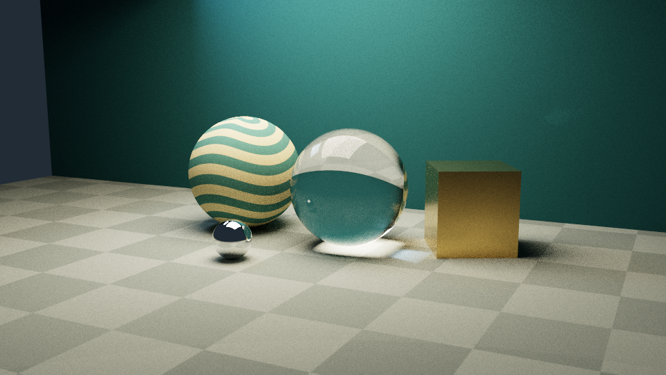
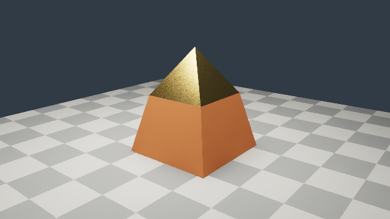
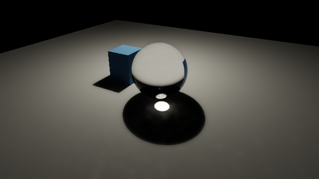
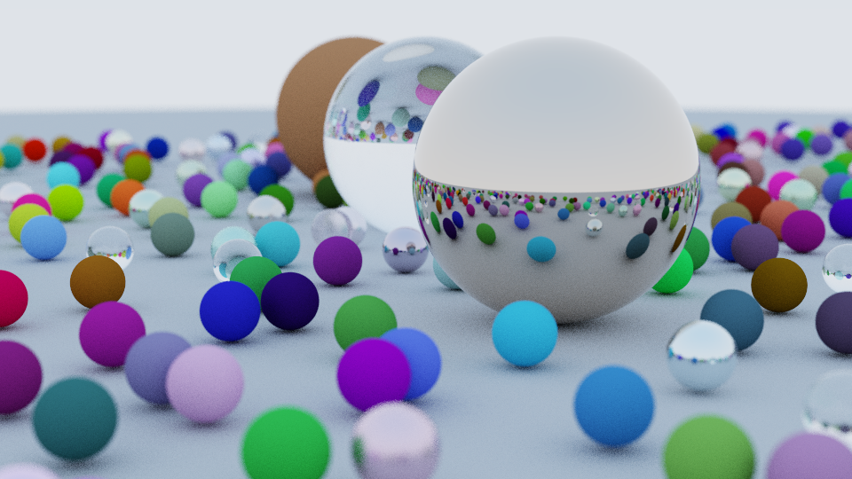
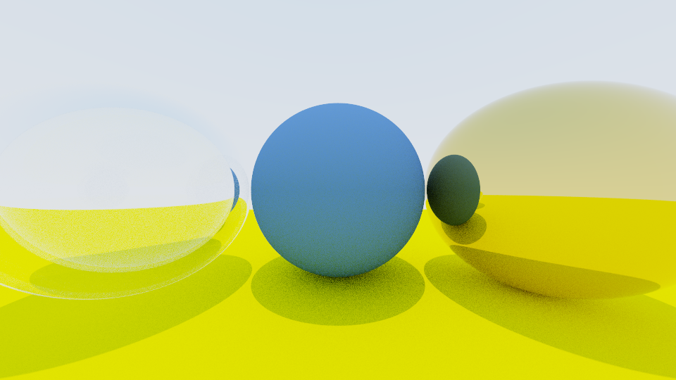

# RayTracer

A C++20 CPU path tracer with a progressive SDL viewer and a portable headless
renderer. It supports OBJ meshes, diffuse/reflective/refractive materials, area
lights, caustic photon mapping, edge-aware denoising, and linear HDR export.
Rendering is reproducible across CPU worker counts. An optional ML pipeline trains
a compact reconstruction model on this renderer's own data and runs it in the viewer.

**[ML walkthrough](ml/README.md)** · [results gallery](ml/reports/README.md)
· [trained model and results](ml/reports/model_card.md)
· [dataset provenance](ml/reports/dataset_card.md). The bundled pilot model targets
diffuse pinhole scenes; speed and image quality depend on the scene and method.



*Studio · 960 × 540 · 256 samples/pixel · depth 16 · seed 42.
Rendered by this project. Full settings and timing: [studio.json](docs/renders/studio.json).*

## Learned reconstruction results

The custom model was trained from scratch on **2,304 paired examples generated by
this renderer**. It uses noisy measurements and geometry guides to predict a cleaner
image while the path tracer's original samples remain intact.

| Raw path tracing · 4 samples/pixel | A-trous denoising · 4 samples/pixel |
| :---: | :---: |
|  |  |
| **Our trained U-Net · 4 samples/pixel** | **Independent reference · 512 samples/pixel** |
|  |  |

*Same held-out view, 256 × 144 per panel, depth 16, exposure 0. The first three
methods use the same 4-sample input; the reference uses an independent 512-sample
render. This is the first test configuration (`g0027-v000-n0-s4`), not an image
selected for its score. OIDN is included in the aggregate metrics below, but is
not one of these four panels.*

Across **all 360 test images** (1–32 samples/pixel, five held-out layouts):

| Method | PSNR ↑ | SSIM ↑ |
| --- | ---: | ---: |
| Raw path tracing | 25.84 dB | 0.5224 |
| A-trous denoising | 33.97 dB | 0.9440 |
| Our trained U-Net | 35.96 dB | 0.8929 |
| Open Image Denoise 2.5.1 | 39.44 dB | 0.9714 |

The custom model improves average image error over raw and a-trous, while a-trous
retains better structural similarity. OIDN has the strongest quality in this study.
At the measured joint quality target, **a-trous is faster than our model**.

The [model improvement plan](docs/neural-reconstruction-improvement-plan.md) audits
edge/detail loss and the other known limitations, with prioritized experiments and
quality, stability and speed gates for the next model.
The [active detail study](ml/reports/detail-study.md) records the expanded scene
collection, augmentation and capacity comparisons, and the artifact progress command.
The [training diagnosis](ml/reports/learning-diagnosis.md) documents the stalled
U-Net investigation, radiance-conditioning correction, and model/fallback HDR audit.

The [full results and error image](ml/reports/README.md),
[model card](ml/reports/model_card.md), and [timing report](ml/reports/timing.md)
include the evidence and limitations. The 2× and temporal modes have working smoke
runs; a quality or speed advantage for those extensions has not been established.

## Build and run

Requires a C++20 compiler with latch support and CMake 3.21 or newer.
The macOS repository includes SDL2. On Linux or Windows, install SDL2's development
package or select the headless build below.

```sh
cmake -S . -B build -DCMAKE_BUILD_TYPE=Release
cmake --build build --config Release --parallel
./build/raytracer
```

On Windows with the Visual Studio generator, the executable is
`build/Release/raytracer.exe`. Point `CMAKE_PREFIX_PATH` at an SDL2 installation if
CMake cannot find it. On Debian/Ubuntu, the development package is `libsdl2-dev`.

**Without SDL or Xcode:**

```sh
cmake -S . -B build-headless -DCMAKE_BUILD_TYPE=Release -DRAYTRACER_ENABLE_SDL=OFF
cmake --build build-headless --config Release --parallel
./build-headless/raytracer --scene studio --width 960 --samples 128 --output renders/studio.png
```

The headless build has no SDL, external image-package, or asset-download requirement.
OBJ parsing and PNG/HDR encoding use the vendored headers listed in
[third-party notices](third_party/README.md).
CMake presets `release`, `headless`, and `sanitize` are also available when Ninja
is installed.

**Xcode:** Open `RayTracer.xcodeproj`, select the shared **RayTracer** scheme,
and Run. The project uses local ad-hoc signing and no personal development team.
The scheme runs in the project directory, so default exports go into `renders/`.
CMake and Xcode compile the same rendering sources.

If a local build warns about nonexistent SDL search paths, check your shell's
`LIBRARY_PATH`. The repository does not need hard-coded Homebrew version paths.
For example, `env -u LIBRARY_PATH cmake --build build` avoids stale shell entries
on macOS/Linux.

## Desktop controls

The preview refines over successive sample passes. The HUD shows the scene,
render status, completed samples, elapsed wall time, worker count, and exposure.

| Key | Action |
| --- | --- |
| `1`, `2`, `3`, `4` | Switch to demo, sphere field, studio, or the caustic demonstration |
| `D` | Toggle denoising for preview and export |
| `N` | Toggle learned reconstruction (requires `--model`) |
| `V`, `E` | Show matching reference or error (requires `--reference`) |
| `C` | Toggle caustic photon mapping; restarts rendering |
| `G` | Toggle approximate glass shadow transmission; restarts rendering |
| `Space` | Pause/resume |
| `R` | Restart the current scene with the same seed |
| `S` | Save the latest complete pass in the selected format + JSON |
| `Esc` | Cancel rendering and keep the preview |
| `Q` / window close | Quit |
| `+`, `-` | Adjust display exposure by 0.25 stops |

Completed renders export automatically. Use `--output` to choose a path;
otherwise the destination is `renders/SCENE.png`. Saving or rerendering to the same
path replaces that image and its metadata. Exposure changes affect preview/export
without restarting the paths; press `S` to save the adjusted image.
HDR/PFM exports always retain linear radiance without exposure or tone mapping.
`C` and `G` select separate lighting modes to avoid counting transmitted light
twice. `4` enables a 300,000-photon caustic demonstration; the CLI exposes the
scene and photon settings independently.

When Finder launches the app with `/` as its working directory, exports instead
use `~/Library/Application Support/RayTracer/renders/`. An explicit `--output`
always takes precedence.

## Reproducible renders

```sh
./build/raytracer --headless --scene field --width 960 --samples 128 --depth 16 --seed 42 --threads 8 --output renders/field.png
```

Headless mode prints machine-readable render metadata on stdout and progress on
stderr. Add `--quiet` to suppress progress. Interrupting with Ctrl-C saves the
last completed sample pass when one is available and exits with code 130.

Use `--help` for all options. Defaults are studio, width 640, 64 samples/pixel,
depth 16, seed 42, automatic worker count, BVH enabled, and exposure 0.
`--no-bvh` enables the linear traversal baseline. `--quit-after-render` closes
the desktop viewer after exporting.

The same seed and settings produce identical image bytes across worker counts
and BVH/linear traversal within a build. JSON sidecars record all rendering
options needed to reproduce the image. Compiler/platform floating-point
differences are handled with tolerances in the reference-image tests.

## Meshes, HDR, and denoising

```sh
./build/raytracer --mesh assets/meshes/pedestal.obj --denoise
./build/raytracer --headless --scene studio --samples 256 --output renders/studio.hdr
./build/raytracer --headless --scene studio --samples 256 --output renders/studio.pfm
```

OBJ import supports indexed positions, normals, UVs, negative indices, polygon
triangulation, and a subset of MTL surface materials. The imported object is
normalized to two units along its longest axis and placed in a lit studio.
MTL diffuse colors, metallic surfaces, and refractive glass are supported;
image textures and emissive MTL light registration are reported as unsupported.
Use triangulated meshes when exact control over polygon tessellation matters.



*Imported pedestal OBJ · 640 × 360 · 64 samples/pixel · depth 16 · seed 42 ·
a-trous denoising. [Render metadata](docs/renders/mesh.json).*

PNG output now uses compressed DEFLATE while retaining the same tone-mapped RGB
pixels. Radiance `.hdr` stores RGBE values; `.pfm` stores float32 RGB and is the
preferred lossless-to-float32 training-data export. Both preserve values above
one. Every output receives a JSON sidecar with settings and timing.

`--denoise` applies a spatial a-trous filter guided by primary-hit normals,
depth, and albedo. It reduces diffuse surface noise while protecting edges;
glass, metal, and emitters are left unfiltered. It does not change accumulated
samples. The current filter has no temporal history, and its pinhole guide
approximation is less reliable with strong depth of field.

## Caustics and glass shadows

```sh
./build/raytracer --scene caustics --caustics 1000000 --caustic-radius 0.08 --denoise
./build/raytracer --scene caustics --glass-shadows transparent
```



*Caustics · 640 × 360 · 128 samples/pixel · depth 16 · seed 42 · 1,000,000 photons ·
gather radius 0.08 · a-trous denoising. [Render metadata](docs/renders/caustics.json).*

Caustic mapping traces light through ideal reflections/refractions and gathers
the resulting flux on diffuse surfaces. The ordinary path estimator excludes
the corresponding emitter paths to avoid double counting. The map is fixed
for each render: more camera samples do not increase its photon count. More
photons and a smaller gather radius can resolve finer caustic detail at a cost
in memory and tracing time. This is a biased density estimate, not progressive
photon mapping or a general bidirectional integrator. It supports registered
point, directional, and quad lights, with diffuse receivers and ideal specular
chains; rough-metal and environment-light caustics remain outside its scope.

`--glass-shadows transparent` provides a cheaper straight-connection
approximation with Fresnel transmission and total internal reflection checks.
It does not bend shadow rays or focus light. Physical caustic mapping and this
approximation are mutually exclusive. In physical mode, a straight shadow
connection remains occluded by glass; refracted illumination arrives through
the photon/path transport instead.

See [rendering extensions](docs/rendering-extensions.md) for estimator details,
format guarantees, and validation.

## Scenes

| Preset | What it demonstrates |
| --- | --- |
| `demo` | Original five-sphere setup, hollow glass, mirror metal, and directional lighting |
| `field` | Hundreds of seeded spheres, three material families, depth of field, and BVH scaling |
| `studio` | Procedural textures, GGX metal, rotated geometry, glass, soft shadows, and two area lights |
| `caustics` | Point-light refraction through a glass sphere onto a diffuse floor |



*Sphere field · 960 × 540 · 128 samples/pixel · depth 16 · seed 42.
[Render metadata](docs/renders/field.json).*

The field's distribution and camera settings were recovered from commit
`488bb80`. Its explicit RNG and updated material models replace the older global
RNG and fuzzy-metal approximation, so it is a reproducible restoration of that
scene rather than a pixel-identical reconstruction of the historical screenshot.



*Demo · 960 × 540 · 64 samples/pixel · depth 16 · seed 42.
[Render metadata](docs/renders/demo.json).*

Rebuild the entire gallery:

```sh
python3 scripts/render_gallery.py --binary build/raytracer
```

## Engineering changes

- Correct entry/exit intersections and face normals for translated and rotated boxes.
- Finite point/area-light shadow segments and explicit parallel slab handling.
- Additive emission, direct illumination, and indirect scattering; BSDF/light MIS.
- Lambertian textures, GGX conductors, ideal mirrors, Fresnel glass, and emissive quads.
- Median-split BVH and persistent workers processing 16 × 16 tiles.
- Per-pixel/sample random streams, independent of scheduling and worker count.
- Complete-pass publication, cancellation, pause/resume, and owned SDL resources.
- Compressed PNG, linear RGBE/PFM export, and JSON sidecars.
- OBJ/MTL mesh import, geometry-guided filtering, and a separate caustic photon pass.
- CMake/CTest, native Xcode tests, and CI for Linux, macOS, and Windows.

See [architecture and numerical details](docs/architecture.md) for the estimator,
threading model, component map, tests, and limitations.

## Performance

[Recorded benchmark results](docs/benchmarks.md) compare linear traversal on one
worker, BVH on one worker, and BVH on multiple workers. Every timed configuration
must produce the same PNG SHA-256 before the script reports a speedup.

```sh
python3 scripts/benchmark.py --binary build/raytracer --width 320 --samples 16 --depth 12 --threads 8 --repeats 3
```

Results include individual runs, medians, CPU/platform information, build time,
ray counts, and settings. Timings measure this corrected renderer with different
acceleration settings; they are not a comparison against the old renderer's
different lighting model.

## Tests

```sh
ctest --test-dir build -C Release --output-on-failure
```

Python 3 enables the CLI/PNG integration suite. The C++ suite covers intersections,
BVH equivalence, light visibility, material sampling, energy against numerical
quadrature, deterministic output, pause/cancellation, and four image regressions.
Additional tests cover mesh import, filter error reduction, photon energy and
path partitioning, HDR/PFM decoding, and PNG compression.
The SDL suite tests texture updates, keyboard controls, and shutdown with its
dummy driver. Xcode's default **RayTracer** scheme runs native geometry tests.
The separate **RayTracer UI** scheme contains interactive launch/control tests
and needs an available desktop. See [validation results](docs/validation.md) for
the current Xcode UI automation limitation and manual viewer checks.

Address and undefined-behavior sanitizers:

```sh
cmake -S . -B build-sanitize -DCMAKE_BUILD_TYPE=Debug -DRAYTRACER_ENABLE_SDL=OFF -DRAYTRACER_SANITIZERS=ON
cmake --build build-sanitize --parallel
ctest --test-dir build-sanitize --output-on-failure
```

[Reference-image policy](tests/reference/README.md) explains tolerances and
intentional regeneration. C++ formatting is defined in `.clang-format`.

For a separate race-checking build, use `-DRAYTRACER_THREAD_SANITIZER=ON` instead
of `-DRAYTRACER_SANITIZERS=ON` with Clang/GCC. Do not combine the two sanitizers.

## Scope and attribution

This started by following
[Ray Tracing in One Weekend](https://raytracing.github.io/books/RayTracingInOneWeekend.html).
The progressive application, reproducible execution, corrected box/light
extensions, tests, benchmarks, and studio scene build on that foundation.
[The Next Week](https://raytracing.github.io/books/RayTracingTheNextWeek.html) and
[The Rest of Your Life](https://raytracing.github.io/books/RayTracingTheRestOfYourLife.html)
are references for acceleration and sampling.

The renderer uses analytic primitives and triangle meshes with finite path depth.
It currently has no image texture loader or participating media. The learned
reconstruction models have a restricted diffuse training domain. Caustic maps have finite-radius bias, and approximate
glass shadows do not reproduce refraction. SDL2 remains under its bundled
upstream license; vendored OBJ/image code retains its own license notices.

The ML pipeline trains and deploys a custom reconstruction model using paired
renders generated by this project. Native inference is optional, with a bundled
pilot model and reproducible dataset/training/evaluation commands. See the
[ML walkthrough](ml/README.md) and [measured model card](ml/reports/model_card.md).
The [research design](docs/neural-rendering-plan.md) records the wider roadmap;
2× and temporal extensions are implemented but require further quality studies.
