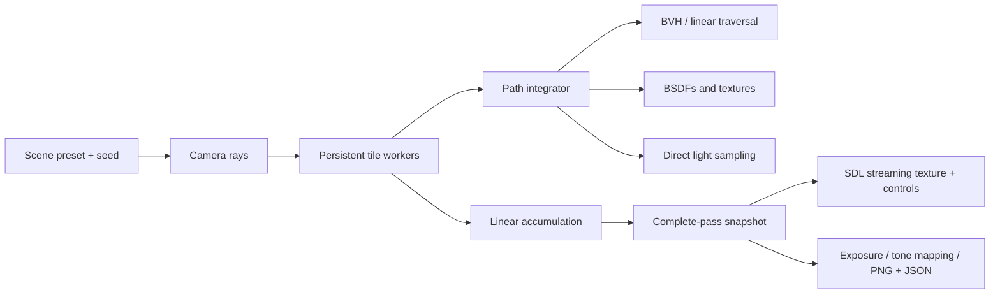

# Renderer architecture

The renderer is a C++20 library with no windowing or image-library dependency.
The desktop executable adds SDL2; the same executable can also render headlessly.

## Responsibilities

| Component | Responsibility |
| --- | --- |
| `camera.h` | Viewport, jittered pixel rays, and thin-lens depth of field |
| `integrator.cpp` | Throughput, emission, direct illumination, scattering, and MIS |
| `material.h` | Lambertian, GGX conductor, ideal mirror, dielectric, and emission |
| `texture.h` | Solid colors, world-space checkerboards, and UV bands |
| `sphere.h`, `cube.h`, `quad.h` | Intersections, oriented normals, UV coordinates, and bounds |
| `aabb.h`, `bvh.h` | Robust slab tests and median-split spatial hierarchy |
| `scene.cpp` | Reproducible geometry, lights, and camera presets |
| `renderer.cpp` | Worker lifetimes, tile scheduling, cancellation, and publication |
| `framebuffer.cpp` | Display conversion and portable PNG output |
| `sdl_window.cpp` | Main-thread events, texture upload, HUD, and SDL resource ownership |
| `main.cpp` | Validated CLI, session controls, exports, and metadata |

Each header declares its own dependencies. The old umbrella header remains for
convenience but contains no SDL state and is not required for include ordering.
Non-inline implementation lives in translation units linked through
`raytracer_core`.

## Light transport

A path accumulates **emission + direct illumination + continued scattering**.

At each surface:

1. Add front-facing emission. For an area emitter reached by a non-delta BSDF
   sample, weight this contribution against the competing light-sampling PDF.
2. Select one registered light uniformly. Point and directional lights are delta
   distributions; area lights sample a point uniformly on a quad and convert area
   density to solid-angle density.
3. Evaluate the current material's BSDF, surface cosine, and shadow visibility.
   Divide the contribution by the light's PDF, including the probability of
   selecting that light.
4. Sample the material and multiply path throughput by
   `BSDF * abs(cosine) / PDF`. The Lambertian cosine-sampling terms cancel to
   albedo; ideal reflection/refraction use their discrete branch weights.
5. Continue from an offset surface point until the depth limit or an invalid/zero
   scattering contribution.

The power heuristic combines BSDF and area-light estimates. At the final allowed
vertex, direct illumination uses weight one because a competing continuation
will not be sampled. This boundary case is covered by an energy test.

Dielectrics use Schlick reflection, total internal reflection, and the squared
relative-index factor for radiance transmission. Rough conductors use an isotropic
GGX normal distribution, Smith masking, and Schlick Fresnel. Zero roughness uses
a separate ideal-mirror branch.

Point-light visibility stops before the light position; directional-light
visibility extends to infinity. Shadow rays begin at a scale-aware normal offset.
Glass does not receive a diffuse lighting multiplier.

## Geometry and acceleration

Box intersections operate in the box's orthonormal frame. The algorithm tracks
both entry and exit parameters and the world-space normals of those slab faces.
A ray whose entry is outside the valid interval can still return its exit.
Parallel directions are handled explicitly, including rays on slab boundaries.

Every primitive supplies world-space bounds, including rotated boxes and padded
planar quads. The BVH sorts along the longest bounding-box axis and splits at the
median. This intentionally simple baseline can be compared with the original
linear traversal using `--no-bvh`. It is not a surface-area-heuristic builder.

## Deterministic concurrency

The image is partitioned into 16 × 16 tiles. Persistent workers claim tiles
through an atomic index; each pixel receives one sample per pass.

A sampler is initialized from **render seed, pixel index, and sample index**.
It owns its state, uses SplitMix64 and an explicit integer-to-double conversion,
and does not depend on the worker ID or tile order. Each pixel accumulates samples
in the same order regardless of scheduling. Scene construction has its own
sampler, separate from camera paths.

At a pass barrier, one completion function publishes the averaged linear buffer,
updates counters, and decides whether all workers should stop. All workers follow
that shared decision. Cancellation checks during tile work let a paused or active
session stop promptly; incomplete passes are discarded. Startup uses a latch so
partial thread-creation failure can release and join the threads already created.

The UI only reads copies of the published buffer under a mutex. It never reads a
pixel while a worker writes it. All SDL operations stay on the main thread.
Pause takes effect at tile boundaries; elapsed time is wall time and includes
pauses. Cancellation and destruction join every worker.

## Output and reproducibility

Linear floating-point radiance stays in the framebuffer. Export and preview
apply exposure in stops, a fitted ACES filmic curve, and the sRGB transfer
function. Both use the same conversion.

The PNG writer emits RGB8 PNG with an sRGB chunk and an uncompressed DEFLATE
stream. It has no external dependencies; the tradeoff is larger files. Tests
independently validate chunk CRCs, decompress the stream with Python's zlib, and
cover multiple DEFLATE blocks.

JSON beside each PNG records the preset, seed, dimensions, completed/target
samples, depth, worker count, traversal choice, timings, ray counts, exposure,
and sampler/integrator identifiers. A cancelled image can be reproduced by using
its completed sample count. Different platforms can introduce small
floating-point differences; exact equality is tested between worker and traversal
configurations within a build.

## Validation

The CTest core suite checks geometry, bounds, BVH equivalence over thousands of
rays, finite shadows, falloff, TIR, material PDFs, reflected sky light, and additive
direct illumination. Area-light estimates at two path depths are compared against
an independent numerical quadrature of a diffuse patch under a square emitter.

Concurrency tests exercise pause, resume, cancellation while paused, startup
cancellation, and teardown. Three fixed-seed reference images detect visual
regressions with documented tolerances. CLI tests cover settings, errors, JSON,
PNG decoding, identical output across configurations, and interrupt handling.
SDL tests use the dummy video driver to exercise texture updates and controls.

The Xcode project adds native geometry tests and optional UI launch/control tests
in the separate **RayTracer UI** scheme. The
portable core and export tests run through CTest in both desktop and headless
builds.

Native UI automation selects SDL's software presenter so occluded test windows do
not wait on Metal drawables. Normal desktop runs prefer the accelerated presenter.
Xcode 26.6 intermittently fails to discover this SDL window during UI automation;
[validation notes](validation.md) distinguish those failures from passing checks.

## Current limits

- CPU rendering and analytic spheres, oriented boxes, and quads; no mesh importer.
- Finite depth and negligible-throughput termination introduce truncation bias.
- Shadow rays treat glass as opaque; transparent shadow transmission and a
  dedicated caustic sampler are not implemented.
- The sky is sampled through BSDF continuation, without environment importance sampling.
- GGX models a single microfacet scattering event; there is no denoiser or
  adaptive sampling.
- PNG is an 8-bit display export, not a linear HDR interchange format.

References:
[Ray Tracing in One Weekend](https://raytracing.github.io/books/RayTracingInOneWeekend.html),
[The Next Week](https://raytracing.github.io/books/RayTracingTheNextWeek.html),
[The Rest of Your Life](https://raytracing.github.io/books/RayTracingTheRestOfYourLife.html).
