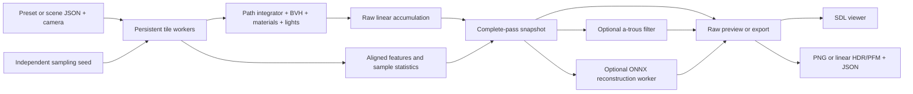

# Renderer architecture

The renderer is a C++20 library with no windowing or external image-library dependency.
OBJ/image helpers are compiled from pinned vendored headers.
The desktop executable adds SDL2; the same executable can also render headlessly.
Learned reconstruction adds an optional ONNX Runtime dependency. Python is used
for offline ML work and is not required by the native model viewer.

## Responsibilities

| Component | Responsibility |
| --- | --- |
| `camera.h` | Viewport, jittered pixel rays, and thin-lens depth of field |
| `integrator.cpp` | Throughput, emission, direct illumination, scattering, and MIS |
| `material.h` | Lambertian, GGX conductor, ideal mirror, dielectric, and emission |
| `texture.h` | Solid colors, world-space checkerboards, and UV bands |
| `sphere.h`, `cube.h`, `quad.h`, `triangle.h` | Intersections, oriented normals, UV coordinates, and bounds |
| `aabb.h`, `bvh.h` | Robust slab tests and median-split spatial hierarchy |
| `scene.cpp` | Reproducible geometry, lights, and camera presets |
| `scene_file.cpp` | Versioned scene/camera JSON, validation, and preset serialization |
| `renderer.cpp` | Worker lifetimes, tile scheduling, cancellation, and publication |
| `framebuffer.cpp` | Display conversion, compressed PNG, linear HDR/PFM output |
| `mesh.cpp` | OBJ/MTL import and mesh normalization |
| `caustics.cpp` | Specular photon transport, spatial indexing, diffuse gathers |
| `denoiser.cpp` | Geometry-guided spatial filtering |
| `feature_buffers.cpp` | Aligned float guide export and 17-channel NCHW input packing |
| `reconstruction.h`, `neural_denoiser.cpp` | Optional ONNX inference, temporal reprojection, bounded background work and results |
| `sdl_window.cpp` | Main-thread events, texture upload, HUD, and SDL resource ownership |
| `main.cpp` | Validated CLI, session controls, exports, and metadata |

Each header declares its own dependencies. The old umbrella header remains for
convenience but contains no SDL state and is not required for include ordering.
Non-inline implementation lives in translation units linked through
`raytracer_core`.

## Light transport

A path accumulates **emission + direct illumination + continued scattering**.

At each surface:

1. Add front-facing emission. For an area emitter reached by a non-delta BSDF
   sample, weight this contribution against the competing light-sampling PDF.
2. Select one registered light uniformly. Point and directional lights are delta
   distributions; area lights sample a point uniformly on a quad and convert area
   density to solid-angle density.
3. Evaluate the current material's BSDF, surface cosine, and shadow visibility.
   Divide the contribution by the light's PDF, including the probability of
   selecting that light.
4. Sample the material and multiply path throughput by
   `BSDF * abs(cosine) / PDF`. The Lambertian cosine-sampling terms cancel to
   albedo; ideal reflection/refraction use their discrete branch weights.
5. Continue from an offset surface point until the depth limit or an invalid/zero
   scattering contribution.

The power heuristic combines BSDF and area-light estimates. At the final allowed
vertex, direct illumination uses weight one because a competing continuation
will not be sampled. This boundary case is covered by an energy test.

Dielectrics use Schlick reflection, total internal reflection, and the squared
relative-index factor for radiance transmission. Rough conductors use an isotropic
GGX normal distribution, Smith masking, and Schlick Fresnel. Zero roughness uses
a separate ideal-mirror branch.

Point-light visibility stops before the light position; directional-light
visibility extends to infinity. Shadow rays begin at a scale-aware normal offset.
Glass does not receive a diffuse lighting multiplier.

## Geometry and acceleration

Box intersections operate in the box's orthonormal frame. The algorithm tracks
both entry and exit parameters and the world-space normals of those slab faces.
A ray whose entry is outside the valid interval can still return its exit.
Parallel directions are handled explicitly, including rays on slab boundaries.

Every primitive supplies world-space bounds, including rotated boxes and padded
planar quads/triangles. Imported meshes participate in the same BVH. The BVH sorts along the longest bounding-box axis and splits at the
median. This intentionally simple baseline can be compared with the original
linear traversal using `--no-bvh`. It is not a surface-area-heuristic builder.

## Deterministic concurrency

The image is partitioned into 16 × 16 tiles. Persistent workers claim tiles
through an atomic index; each pixel receives one sample per pass.

A sampler is initialized from **render seed, pixel index, and sample index**.
It owns its state, uses SplitMix64 and an explicit integer-to-double conversion,
and does not depend on the worker ID or tile order. Each pixel accumulates samples
in the same order regardless of scheduling. Scene construction has its own
sampler, separate from camera paths.

At a pass barrier, one completion function publishes the averaged linear buffer,
updates counters, and decides whether all workers should stop. All workers follow
that shared decision. Cancellation checks during tile work let a paused or active
session stop promptly; incomplete passes are discarded. Startup uses a latch so
partial thread-creation failure can release and join the threads already created.

The UI only reads copies of the published buffer under a mutex. It never reads a
pixel while a worker writes it. All SDL operations stay on the main thread.
Pause takes effect at tile boundaries; elapsed time is wall time and includes
pauses. Cancellation and destruction join every worker.

## Learned reconstruction

Offline ML work lives in `ml/src/raytracer_ml`: procedural scene generation and
resumable paired rendering, validation, streaming crop datasets, trainable networks,
checkpoint/resume, full-image evaluation, export and native benchmarking. See the
[package and artifact map](ml-project-structure.md) and [working commands](../ml/README.md).
Training inputs and targets share a complete scene/camera but have independent
sampling seeds. Group splits precede crops and keep related noise variants together.

During native rendering, optional first-hit probes follow the same jittered primary
rays as RGB. They accumulate albedo, normal, depth, hit coverage and diffuse support.
Welford moments track per-channel sample variance; publication exports variance of
the mean with an explicit unavailable flag at one sample. A center-ray position
buffer supports temporal reprojection. These probes are counted in `feature_rays`
and do not advance the random generator used by light transport.

`frame_snapshot` carries raw radiance, completed sample count and optional features.
The exported graph accepts raw float NCHW channels and contains preprocessing,
HDR residual prediction and unsupported-pixel fallback. Spatial models take 17
channels; temporal models take 21, adding valid previous RGB and its mask. A scale-2
model outputs twice the traced width and height. Temporal and scale-2 modes are
currently separate model configurations.

A reconstruction worker owns the ONNX session and performs inference away from SDL.
New requests replace one pending snapshot, while the current request finishes.
Results retain their raw snapshot, matching render statistics and generation ID;
the UI discards results from an old render generation. Exports wait for the requested
completed-pass prediction. Predictions are never written into raw accumulation.
Missing/incompatible models report a fallback, and disabling ONNX at build time
preserves the conventional executable.

Temporal history belongs to the previous camera frame. Geometry/light identity,
dimensions, camera displacement, normals, support and world-position agreement gate
reprojection. Repeated passes from a static camera retain a fixed previous-frame
history; cumulative means are not repeatedly counted as independent observations.
`--sequence` supplies ordered complete scene JSON files to the viewer or headless
loop. The [temporal walkthrough](../ml/README.md#upscaling-and-temporal-history)
explains its training and stability limitations.

The viewer can select raw, a-trous or learned output. Reference and error views
require a raw PFM plus matching scene/camera, dimensions and transport metadata.
The error view uses four times the absolute linear difference followed by display
conversion. The HUD's sample count represents real tracing work.

## Output and reproducibility

Linear floating-point radiance stays in the framebuffer. Export and preview
apply exposure in stops, a fitted ACES filmic curve, and the sRGB transfer
function. Both use the same conversion.

The PNG writer emits RGB8 PNG with an sRGB chunk and compressed DEFLATE using
vendored stb code. Tests independently validate chunk CRCs and decompress the
stream with Python's zlib. HDR and PFM exports preserve linear radiance without
the display transform, and have independent decoder tests.

JSON beside each exported image records the preset, seed, dimensions, completed/target
samples, depth, worker count, traversal choice, timings, ray counts, exposure,
and sampler/integrator identifiers. Neural exports also record model path,
reconstruction/fallback status, requested execution provider, inference/model-load
time and pipeline duration. Model hashes and tensor schema accompany the versioned
ONNX artifact. A cancelled image can be reproduced by using
its completed sample count. Different platforms can introduce small
floating-point differences; exact equality is tested between worker and traversal
configurations within a build.

## Validation

ML tests cover data integrity, group leakage, exact CPU resume, raw preservation,
model/export parity, 2× output, temporal rejection, scene serialization and fallback.
SDL + ONNX builds additionally check asynchronous save and sequence shutdown.
[Validation evidence](validation.md) records the tested platforms and CI results.

The CTest core suite checks geometry, bounds, BVH equivalence over thousands of
rays, finite shadows, falloff, TIR, material PDFs, reflected sky light, and additive
direct illumination. Area-light estimates at two path depths are compared against
an independent numerical quadrature of a diffuse patch under a square emitter.

Concurrency tests exercise pause, resume, cancellation while paused, startup
cancellation, and teardown. Four fixed-seed reference images detect visual
regressions with documented tolerances. CLI tests cover settings, errors, JSON,
PNG decoding, identical output across configurations, and interrupt handling.
SDL tests use the dummy video driver to exercise texture updates and controls.

The Xcode project adds native geometry tests and optional UI launch/control tests
in the separate **RayTracer UI** scheme. The
portable core and export tests run through CTest in both desktop and headless
builds.

Native UI automation selects SDL's software presenter so occluded test windows do
not wait on Metal drawables. Normal desktop runs prefer the accelerated presenter.
Xcode 26.6 intermittently fails to discover this SDL window during UI automation;
[validation notes](validation.md) distinguish those failures from passing checks.

## Rendering extensions and limits

[Rendering extensions](rendering-extensions.md) defines the OBJ material subset,
linear formats, filter behavior, photon estimator, and transparent-shadow
approximation. The photon pass runs before camera sampling and is included in
render time. Display filtering is timed separately and never modifies samples.

The renderer still has finite path-depth bias and no image texture loader,
participating media or environment importance sampling. The trained model covers
a narrow diffuse pinhole domain; 2× and temporal variants have smoke evidence,
with their quality/stability studies still open. Caustic mapping covers registered lights and ideal specular chains onto
diffuse receivers, with finite-radius density-estimation bias. The optional
straight glass shadow approximation cannot reproduce refraction or focusing.

References:
[Ray Tracing in One Weekend](https://raytracing.github.io/books/RayTracingInOneWeekend.html),
[The Next Week](https://raytracing.github.io/books/RayTracingTheNextWeek.html),
[The Rest of Your Life](https://raytracing.github.io/books/RayTracingTheRestOfYourLife.html).
