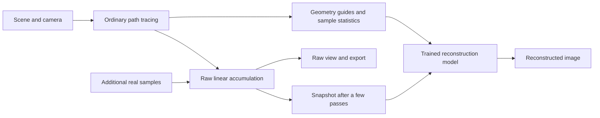

# AI-assisted ray tracing

Status: implemented foundation in v3.0.0. A custom spatial model has been trained
and integrated into the C++ renderer. Dataset, training, evaluation, export and
benchmark commands are available in the [ML walkthrough](../ml/README.md).
Trainable 2× and temporal variants have end-to-end smoke coverage; their research
quality gates remain open. See the [model card](../ml/reports/model_card.md) for
actual evidence and limits.

The [ML project structure](ml-project-structure.md) specifies the package layout,
dataset contract, experiment tracking, checkpoints, automation, and deliverables.

## Goal and learning task

Train our own small reconstruction model to produce an accurate image from fewer
real path-traced samples. The renderer continues to calculate geometry, visibility,
materials, and light paths. The network estimates the clean image those noisy
measurements are converging toward.

Training pairs come from this renderer: low-sample RGB and geometry/statistics as
inputs, and independent high-sample RGB as the target. Train offline; during normal
rendering, use the saved model for inference. A pretrained denoiser is a comparison
baseline, not a substitute for the project's custom training work.

This replaces the earlier geometry-to-indirect-light proposal. The new model sees
actual noisy lighting and reconstructs complete RGB. Separate direct/indirect
labels and a learned scene representation are no longer prerequisites.

This approach is called **learned denoising or ray reconstruction**. Reconstruction
can also include super resolution, as described in NVIDIA's
[DLSS Ray Reconstruction research](https://research.nvidia.com/labs/adlr/DLSS4/).
That is a research reference, not a promise of DLSS performance or compatibility.
Our implementation targets the current Apple M3 Pro.

One completed pass already samples every pixel once. Early images have noisy
lighting estimates rather than literal empty pixels. Begin with reconstruction at
the same resolution; rendering fewer pixels and upscaling comes later. For example,
8 instead of 128 samples/pixel means 16 times fewer camera-path samples, but not a
demonstrated 16-times speedup. Inference and other overhead count, and quality must
be comparable.

## Runtime design

- **Fast render:** trace a selected small budget, reconstruct, and stop. This can
  save total work if the result meets the required quality.
- **Progressive preview:** reconstruct early snapshots while tracing continues,
  refreshing as samples arrive. This reduces time to a useful preview; completing
  the original tracing budget does not itself reduce total tracing work.

Never feed predictions into raw accumulation or count them as measured samples.
Keep raw and reconstructed views/exports separate. Fixed sample budgets come
first; learned stopping rules and adaptive per-pixel sampling are deferred.

## Milestones

| Stage | Work | Completion evidence |
| --- | --- | --- |
| 1. Paired data and measurement | Export noisy snapshots, guides, statistics, and independent references | Reproducible scene/camera configuration, aligned buffers, isolated seeds/splits, checked target noise |
| 2. Train spatial reconstruction | Small convolutional baseline, then a compact U-Net at the same input/output resolution | Debug-set overfit, improved held-out quality, comparisons with raw rendering, a-trous, and a pretrained denoiser |
| 3. Native preview and fast render | Run saved weights on completed passes in C++ | Python/C++ parity, responsive viewer, unchanged raw samples, measured time to matched quality |
| 4. Super resolution | Reconstruct full resolution from half-width/half-height radiance | Better quality/time tradeoff than ordinary upscaling, with thin geometry and small lights retained |
| 5. Temporal reconstruction | Reuse valid history from earlier camera frames | Reduced flicker without unacceptable ghosting or lag after scene changes |
| 6. Research release | Demo, benchmarks, model card, reproducible training and evaluation | Scoped speed/quality claims, failures, weights, manifests, and checksums |

Stages 1–3 are the first deliverable. Test a tiny model's deployment path during
stage 2 before expensive training. Upscaling and history are independently measured
extensions. Fully neural scene rendering is outside this revised roadmap.

## Dataset and renderer changes

Reuse deterministic sampling, completed-pass snapshots, geometry guides, PFM export,
and the existing a-trous filter. Add versioned scene/camera configurations and a
dataset exporter. Separate scene-generation seeds from sampling seeds so a new
noise realization cannot silently change the sphere-field geometry.

Start with 128 distinct scene/camera configurations at 256 × 144, using pinhole
cameras, diffuse materials, analytic objects or simple imported meshes, and varied
area/point lights. Include silhouettes, contact shadows, color bleeding, dark
regions, and bright emitters. Split whole camera-path and scene/lighting groups
before generating noise variants or crops; retain an untouched test set.

For each configuration, save raw snapshots at 1, 2, 4, 8, 16, and 32 samples/pixel
with several independent noise realizations. Shared-prefix snapshots and sibling
variants must stay in one split. Reference samples use independent noise seeds,
initially at 512 samples/pixel. Compare a subset against 2048 samples and independent
repeat renders; increase the reference budget when remaining noise would obscure
method differences. Existing denoising and photon mapping are baselines, not
presumed ground truth. Initial pairs use the ordinary physical path tracer with
approximate glass shadows and caustic mapping disabled.

| Model input | Purpose |
| --- | --- |
| Noisy scene-linear RGB | Actual lighting measurements |
| Normal and albedo | Geometry/material boundaries |
| Depth, hit mask, material/support mask | Silhouettes, background, unsupported surfaces |
| Sample count and variance estimate | Amount and variability of evidence |

Store scene/camera/light descriptions, separate seeds, renderer version, buffer
conventions, hashes, and split IDs in the manifest. Accumulate stable sample moments
alongside radiance, distinguishing sample variance from variance of the mean. At
one sample, variance is unknown: provide a validity mask rather than treating zero
as certainty. These statistics do not guarantee reconstruction accuracy.

Current center-ray guides differ from jittered RGB at silhouettes. Validate
alignment and collect sample-aligned, anti-aliased normal/albedo guides before
treating them as clean neural inputs; preserve separate boundary/depth information.
This also matters for the pretrained baseline: Open Image Denoise documents
[matching reconstruction filters for color and auxiliary images](https://www.openimagedenoise.org/documentation.html#rt).
Depth of field is outside the initial supported domain.

Use raw linear float labels, not tone-mapped PNG, RGBE previews, or filtered images.
Fit normalization on training data only; any per-image scale must be available at
inference and retained to recover HDR output. Stream losslessly compressed arrays.
Measure pilot storage/render cost before expanding to thousands of configurations;
make generation resumable with explicit resource budgets.

## Model, training, and deployment

Train a small convolutional baseline, then a U-Net of roughly 0.5–2 million
parameters with three spatial scales. Use ordinary convolution, activation, resize,
and skip operations for manageable export. Condition on sample budget, guides,
and statistics; compare guide/variance ablations with RGB-only input. Predict
nonnegative scene-linear RGB.

Start with log-radiance L1 plus a linear reconstruction term. Measure highlight
energy and shadow detail as well as display appearance. Avoid generative/adversarial
losses that reward invented texture over reference accuracy. First overfit a tiny
debug set; then select checkpoints on validation scenes. Mix sample budgets and
check that clean/high-sample inputs retain detail. Record seeds, optimizer settings,
learning curves, training time, and checkpoint-selection criteria.

The first supported domain is diffuse scenes. Mirrors, glass, rough metals, depth
of field, and sharp caustics form a separate stress set. Keep raw pixels or the
conventional path for unsupported materials/scenes and label the fallback. Report
both supported-region and full-image quality: diffuse-only gains are not evidence
of whole-scene speedups. Expand training when references and guides are adequate.

Train on the Mac with PyTorch's [MPS backend](https://docs.pytorch.org/docs/stable/notes/mps.html)
and a CPU fallback. Deploy optionally through ONNX Runtime C++: CPU provides a
portable baseline; profile the [Core ML execution provider](https://onnxruntime.ai/docs/execution-providers/CoreML-ExecutionProvider.html)
on macOS. Verify operator coverage, actual execution device, parity, model-loading
cost, and supported image sizes in an early spike. Pin the tested toolchain then.
The conventional renderer must build and run without Python or an ML runtime.

## Progressive integration

Offer raw, current-filter, and AI-reconstruction views, plus reference/error views
when scene, camera, and integrator match an available reference. Show actual traced
samples and elapsed time. Reconstructed exports record model version, input sample
count, inference time, and fallback status; raw exports remain available.

Run inference off the SDL event thread on immutable snapshots, with at most one
pending newest snapshot. Begin at 1/2/4/8/16/32 samples with a wall-time throttle.
Keep the last valid preview while inference runs and discard obsolete results.
Invalidate on scene, camera, resolution, integrator, or model changes. Exposure
stays a display transform. Missing/invalid models fall back with clear status.

Inspect static progressive previews for popping. Early predictions can miss rare
light paths or blur detail; more evidence does not guarantee monotonically better
predictions. Never silently substitute predictions for accumulated measurements.

Implemented modules: `RayTracer/reconstruction.h`, `RayTracer/neural_denoiser.cpp`,
`RayTracer/feature_buffers.cpp`, and the installable package under
`ml/src/raytracer_ml/`. Test raw-output invariance, buffer alignment,
seed/split isolation, export parity, invalid models, stale results, and cancellation.
Large datasets/checkpoints remain outside Git. A compact pilot model, hashes and
model card are bundled; Python and native inference dependencies are optional.

## Upscaling and temporal extensions

First try 2× in each dimension: 256 × 144 noisy radiance to 512 × 288 reconstructed
output. Train aligned low/high-resolution pairs with documented pixel footprints
and jitter. Compare bilinear/bicubic and denoise-then-upscale baselines. Evaluate
optional full-resolution geometry guides and count their additional visibility
rays and memory. Enlarging an image alone does not demonstrate recovered detail.

For camera motion, add trajectories, reprojection/motion information, history masks,
and sequence training. Reject disocclusions, depth/normal mismatches, camera cuts,
and changed lights/geometry. Surface motion alone does not track every reflected
or refracted image. Compare against non-learned temporal filtering; inspect ghosting,
lag, and newly visible surfaces. [Recurrent Monte Carlo denoising research](https://research.nvidia.com/publication/2017-07_interactive-reconstruction-monte-carlo-image-sequences-using-recurrent)
provides a reference for learning temporal reconstruction from sparse samples.

Successive static passes have overlapping samples. Do not treat cumulative means
as independent frames and repeatedly accumulate the same evidence. The first model
is stateless across passes; animation history requires a separate sampling design.

## Evaluation and success criteria

Compare raw path tracing across budgets, the existing a-trous filter, our model,
and an optional pretrained [Open Image Denoise RT baseline](https://www.openimagedenoise.org/documentation.html#rt).
OIDN exposes CPU and Metal devices; verify availability and record the device and
auxiliary preprocessing cost. Publish this comparison even if OIDN performs better.

Report linear HDR error, fixed-exposure display PSNR/SSIM, difficult-region errors,
per-image distributions, and worst cases. Separate held-out cameras, new lighting,
unseen layouts, and unsupported materials. Compare equal resolution, sample budget,
and wall time, and plot quality against total time. Choose quality thresholds on
validation data before testing. Measure **time to matched quality**, including
failures to reach the threshold; avoid selecting only favorable scenes or metrics.

Include scene preparation, tracing, guide/statistics collection, snapshot copies,
packing/transfers, synchronized inference, compositing, and display upload. Report
cold start, warm median/p95, memory, model size, data-generation cost, and training
time. Measure first-useful-preview latency separately from fixed-budget completion.
For continued refinement, count every inference update and contention with tracing.
Give each method equivalent hardware access; load references outside timed runs.

Success means a reproducible improvement over the current filter's time/quality
tradeoff on held-out supported scenes. A 2× reduction in time to matched quality is
an initial stretch target, not a promise. Upscaling/history must also preserve thin
geometry, small bright features, and stability after history invalidation. State
hardware, resolution, sample budgets, and quality criteria for every speed claim.

## Measured release status

The pipeline and renderer modes are implemented and tested. The spatial pilot
improves error over raw rendering and a-trous, but has lower SSIM than a-trous.
At the declared joint quality threshold, a-trous is faster than the custom model.
The stretch target above remains unmet; implementation completion does not imply
that the research hypothesis succeeded. See the [timing report](../ml/reports/timing.md).
