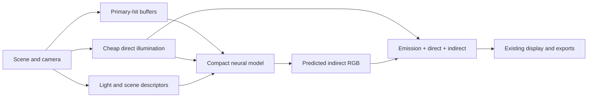

# Proposed ML rendering mode

Status: plan only. The conventional renderer extensions are implemented first;
no model has been trained and no neural speedup is claimed.

## First research question

Can a compact network predict diffuse indirect lighting on held-out camera paths
more efficiently than this renderer's low-sample path tracing plus denoising,
at comparable image quality?

Build a **neural indirect-light mode** first. It still traces primary visibility
and direct-light shadow connections, but replaces secondary indirect-light
paths with a network prediction. This is closest to the geometry-to-shading
approach in [Deep Shading](https://arxiv.org/abs/1603.06078). It is not a claim
of rendering without any rays, and it does not require a CUDA GPU or online
training. [Neural radiance caching](https://research.nvidia.com/publication/2021-06_real-time-neural-radiance-caching-path-tracing)
is a later alternative that adapts a lighting cache during rendering.

Assume local development/training on the current Apple M3 Pro. Start at
256 × 144 with pinhole cameras, diffuse materials, a simple room, up to four
objects, and one or two area lights. Mirrors, glass, caustics, depth of field,
and arbitrary imported meshes stay outside the first model's supported domain.
They remain useful conventional renderer features and later stress tests.

## Runtime design

Keep the model behind a renderer interface, with an optional build dependency.
The conventional C++ renderer and its tests continue to work without Python or
an ML runtime. Train in Python/PyTorch using the
[MPS backend](https://docs.pytorch.org/docs/stable/notes/mps.html), with a CPU
fallback for tests. Deploy through an ONNX Runtime C++ adapter: CPU is the
portable baseline; explicitly register and profile its
[Core ML execution provider](https://onnxruntime.ai/docs/execution-providers/CoreML-ExecutionProvider.html)
on macOS. Confirm operator coverage, numeric parity, actual provider selection,
and model-loading overhead in an early deployment spike. Pin a tested toolchain
combination then, rather than assuming every current exporter/runtime pair works.

## Milestones and completion criteria

| Step | Work | Evidence required to advance |
| --- | --- | --- |
| 1. Measurement and export | Add scene/camera JSON, camera trajectories, and separate emission/direct/indirect float buffers | The three radiance components reconstruct the original estimator; configurations round-trip reproducibly |
| 2. Pilot dataset | Generate 128 views with guide buffers and high-sample references | Inspect targets, verify alignment, estimate render time/disk cost, and quantify remaining reference noise |
| 3. Baselines and model | Train a small convolutional model, then a U-Net with scene/light conditioning | Overfit a tiny debug set, then improve held-out indirect-light error over a constant/zero predictor |
| 4. Generalization study | Expand to a few thousand views across a bounded scene family and run ablations | Separate results for new camera paths, unseen lighting, and unseen layouts; no frame or scene leakage |
| 5. Native inference | Export weights, integrate the C++ runtime, and profile end to end | Python/C++ predictions agree; total latency and memory are measured on the same hardware as baselines |
| 6. Viewer and release | Add reference/prediction/error views, camera-path playback, reports, and a model card | Reproducible demo, documented failures, supported-domain checks, downloadable versioned weights |

Do not generate the full dataset until the pilot validates the labels and the
inference adapter. Dataset generation should be resumable, with an explicit
disk/time cap. Training and larger data generation need their own measured
budgets; an image count alone is not a compute estimate.

## Data and target definition

Extend `integrator.cpp` to classify the contributions of one shared estimator,
preserving its MIS weights. For the diffuse-only first model, direct lighting
has one surface scattering event between the camera and an emitter/environment;
indirect lighting has at least two. Do not obtain the target by subtracting an
independently noisy direct render from a noisy total render.

Use the new raw PFM export and add multi-buffer export; PNG/RGBE previews are not
training labels. Each example contains world position, normal, depth, diffuse
albedo, view direction, validity mask, cheap direct RGB, and reference indirect
RGB. Emission/background are composed separately. Store scene/camera parameters,
sampling seeds, renderer commit, settings, and content hashes in a manifest.
Use float32 arrays with lossless compression and stream batches from disk.

Start references at 512 samples/pixel, then compare a subset against 2048 samples
and an independent seed. Increase the budget if reference noise materially
affects the metric. Use the ordinary physical path tracer as the initial teacher;
the new denoiser and finite-radius photon map are useful baselines, not presumed
ground truth. Split by complete camera paths with spatial gaps, and by complete
lighting/layout groups for the generalization tests. Fit normalization only on
training data. Never tune on the final test split.

## Model

Begin with a small U-Net, approximately 0.5–2 million parameters, three spatial
scales, and ordinary convolution/activation/resize operations that export well.
Predict nonnegative outgoing indirect RGB. Avoid dividing labels by near-zero
albedo. Train with log-radiance L1 plus a modest linear-radiance reconstruction
term; add edge/temporal terms only after demonstrating their effect in ablations.
Record seeds, optimizer settings, validation curves, and checkpoint selection.

A visible geometry buffer cannot uniquely determine light arriving from unseen
objects. Supply an explicit bounded scene descriptor containing object transforms,
dimensions, colors, room parameters, and light positions/shapes/intensities.
Encode it into the U-Net's global conditioning. Test removal of this descriptor
as an ablation. This does not guarantee generalization to arbitrary scenes;
unsupported layouts/materials must be reported rather than silently accepted.

## Evaluation

Compare direct-only rendering; 1/4/16/64-sample path tracing; the same renders with
the conventional denoiser; and the neural mode. Include a nearest-training-view
baseline on the camera test to reveal simple memorization. Evaluate isolated
indirect illumination as well as the full composite. An oracle composite using
reference indirect light plus the same cheap direct pass exposes the quality
ceiling imposed by noisy direct lighting.

Report linear-radiance error and fixed-exposure display PSNR/SSIM, per-image
distributions and worst cases, indirect-light/shadow regions, and motion flicker.
For flicker, reproject world positions between camera frames and reject
disocclusions/depth mismatches; raw adjacent-frame differences also contain
legitimate camera motion. Keep unseen lighting and unseen scene results separate
from familiar-scene camera interpolation.

Time scene preparation, visibility/direct buffers, tensor packing/transfers,
synchronized inference, compositing, and display/upload. Report cold start and
warm median/p95 latency, peak memory, model size, and amortized training/data
cost. Exclude the concurrently running reference renderer from neural latency
measurements, and benchmark both with equivalent hardware access. An initial
aspiration is a 2× lower total latency at matched quality on the supported camera
test; this is an experimental target, not a promised result. A negative speedup
or failure on unseen scenes is still a valid result and belongs in the report.

## Product and repository integration

Add a mode selector alongside the existing path tracer, with reference,
prediction, indirect-only, and error views. References are loaded or rendered
explicitly; label unavailable/stale references by scene and camera hash. Display
the active mode, model version, total latency, and any unsupported input.
Changing a model or scene invalidates cached tensors/references. Run inference
off the SDL event thread and discard stale results after camera changes.

Proposed files: `RayTracer/render_backend.h`, `RayTracer/neural_renderer.cpp`,
`RayTracer/feature_buffers.cpp`, `ml/data/`, `ml/models/`, `ml/train.py`,
`ml/evaluate.py`, and `ml/export.py`. Add CPU smoke tests with a tiny test model,
export/parity tests, dataset schema/split tests, and renderer-mode regression
tests. Keep large datasets/checkpoints outside Git; publish selected weights and
manifests as versioned release artifacts with checksums and a model card.

## Later experiment: a genuinely ray-to-color mode

After the first study, a separate fixed-scene experiment can predict RGB from
camera ray origin/direction without geometric intersections at inference. This
matches the direction of
[Light Field Networks](https://scenerepresentations.org/publications/lfns/).
It should have its own dataset, held-out viewpoints, runtime counters, and
failure analysis. It is a different learned representation, not a toggle that
automatically gives the first shading network zero-intersection rendering.
