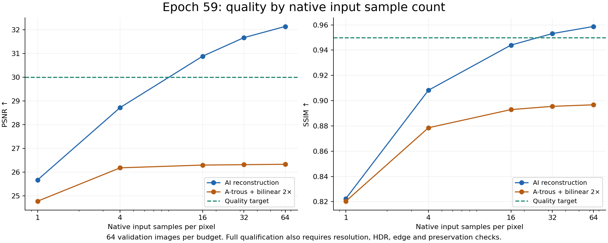
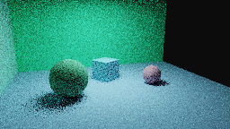
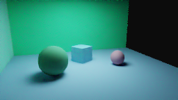
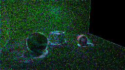
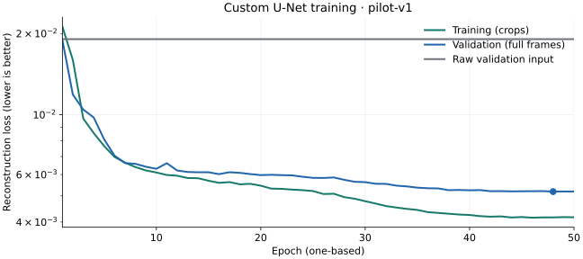
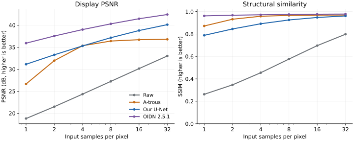

# Ray reconstruction results

## Latest joint 2× reconstruction study

The **[epoch-59 gallery and training charts](joint-reconstruction-results.md)**
show three native validation scenes at 1, 4 and 16 samples/pixel, with noisy input,
a-trous, AI, both AI/denoising orders, and 2,048-spp reference panels. The run stopped at epoch 69; epoch 59
is the selected best. Full quality qualification and rendering speedup remain open.



## Original diffuse pilot (historical)

The following is the evidence index for the first trained model and its native rendering
integration. The main result is a substantial reduction in raw image error; the
custom model does not outperform a-trous at the measured time-to-quality target,
and Open Image Denoise provides better image quality in this experiment.

See the [issue audit and improvement plan](../../docs/neural-reconstruction-improvement-plan.md)
for the next iteration: edge/detail preservation, broader training coverage,
progressive and temporal stability, learned upscaling and measured acceleration.
The [qualification corrections](qualification-fixes.md) document the new checkpoint
and reference-integrity rules, and a baseline comparison of the completed temporal
model: 25.8% lower motion-corrected log error than a-trous on four development layouts.

## Labeled result images

| Raw path tracing · 4 samples/pixel | A-trous denoising · 4 samples/pixel |
| :---: | :---: |
|  |  |
| **Our trained U-Net · 4 samples/pixel** | **Independent reference · 512 samples/pixel** |
|  |  |

**Example:** `g0027-v000-n0-s4`, the first held-out configuration, noise realization
0. Each panel is 256 × 144, maximum path depth 16, exposure 0, ACES-fit + sRGB.
The first three methods share the same noisy measurement. The reference uses an
independent sampling stream. The image is selected by its position in the test
manifest, not by its quality score. No OIDN image is shown in this four-panel grid;
its measurements are included in the quality chart and complete test records.

**Custom reconstruction error — absolute linear difference ×4**



This view computes `4 * abs(prediction - reference)` in linear RGB, then applies
the same display transform. Bright pixels indicate larger error. It is not a
uniformly scaled heat map or a confidence estimate. The 512-spp reference also
contains residual noise; [reference checks](dataset_card.md#pairing-features-and-reference-quality)
describe that limitation.

## Learning and image quality



Loss combines log-radiance L1 with relative linear L1. Validation uses full images;
training uses crops. The marker identifies the lowest validation loss (epoch 48).
This is one training seed, not an average over repeated studies.



Each point averages 60 test images at that budget (20 views × three noise
realizations); all six budgets total 360 images. Views share five held-out layouts.
Higher scores are better. At 4 spp, a-trous and the custom model have similar mean
PSNR; the custom model has lower SSIM. OIDN leads both measures across these budgets.
These are quality comparisons, not speedup measurements.

The [model card](model_card.md) reports exact tables, training settings, model hashes,
intended use and failures. The [timing report](timing.md) records native completion
latency, cold start, median/p95, missed thresholds and the comparison with a-trous.

## What has been demonstrated

| Component | Evidence | Limit |
| --- | --- | --- |
| Spatial reconstruction | Real 2,304-example dataset, 50-epoch training, held-out evaluation and bundled weights | One seed and one procedural scene family |
| Native model mode | ONNX/Python parity, raw preservation, viewer checks and timed renders | CPU baseline; Core ML remains experimental |
| 2× reconstruction | Paired low/high-resolution smoke training and native parity | No established quality or timing advantage |
| Temporal reconstruction | Native sequence parity and lower motion-corrected error on four v2 development layouts | Broader motion, ghosting, release and speed qualification remain open |

## Artifact index

| Record | Files |
| --- | --- |
| Dataset provenance and restrictions | [Dataset card](dataset_card.md), [generation contract](pilot-dataset.json), [group splits](pilot-splits.json), [reference checks](pilot-reference-checks.json) |
| Original complete manifest | [Gzip JSONL manifest](pilot-manifest.jsonl.gz) |
| Pilot training | [Config](pilot-training-config.json), [environment](pilot-environment.json), [50-epoch log](pilot-training.jsonl) |
| Pilot validation | [Summary](pilot-val-summary.json), [all per-image records](pilot-val-per-image.jsonl.gz) |
| Pilot test, including OIDN | [Summary](pilot-test-summary.json), [all per-image records](pilot-test-per-image.jsonl.gz) |
| Native time and quality | [Report](timing.md), [configuration and threshold results](pilot-timing-summary.json), [all native records](pilot-timing-per-image.jsonl.gz), [HTML table](pilot-timing-report.html) |
| Small spatial run | [Summary](smoke-v1-summary.json), [per-image records](smoke-v1-per-image.jsonl.gz) |
| Small OIDN comparison | [Summary](smoke-oidn-summary.json), [per-image records](smoke-oidn-per-image.jsonl.gz) |
| 2× smoke study | [Summary](upscale-smoke-v1-summary.json), [per-image records](upscale-smoke-v1-per-image.jsonl.gz) |
| Temporal/cohort smoke study | [Summary](temporal-smoke-v1-summary.json), [per-image records](temporal-smoke-v1-per-image.jsonl.gz) |
| Trained deployment model | [ONNX weights](../../assets/models/diffuse-pilot-v1.onnx), [schema and hashes](../../assets/models/diffuse-pilot-v1.json) |
| Decisions and remaining experiments | [Experiment ledger](experiments.md), [research roadmap](../../docs/neural-rendering-plan.md) |

The `.jsonl.gz` files are ordinary gzip-compressed, newline-delimited JSON.
Decompress with a gzip utility or read using Python's standard `gzip.open(path, "rt")`.
Download `pilot-timing-report.html` to view its table locally; GitHub normally shows
HTML source. Large float arrays and training checkpoints are ignored local artifacts;
the documented generator and training commands create a new reproducible run.

To rebuild the learning and quality plots from the committed records, run from the
repository root:

```sh
uv run --script ml/reports/plot_results.py
```

This uses the script's pinned Matplotlib dependency and performs no training or new
benchmark measurements. The four labeled image panels reproduce the original
[comparison strip](figures/pilot-4spp.png) exactly. Their labels live in the document,
so saved panel images retain only the measured pixels.

[Setup, training and viewer walkthrough](../README.md) ·
[Renderer documentation](../../README.md) · [Validation evidence](../../docs/validation.md).
