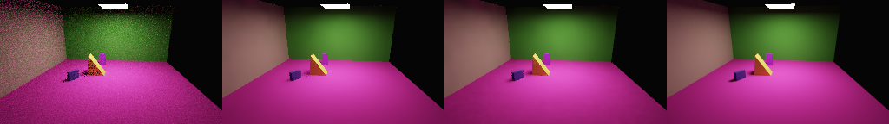
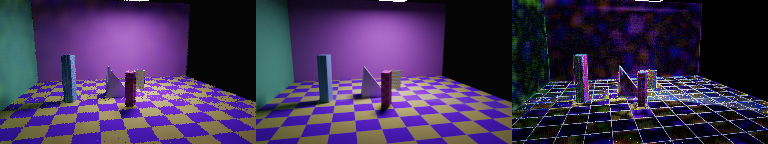

# Detail reconstruction study

Status: implementation and development experiments in progress. The bundled
`diffuse-pilot-v1.onnx` and its measured limitations remain the released baseline.
Passing implementation tests does not establish better image quality or acceleration.
The [research alignment audit](../../docs/neural-reconstruction-research-audit.md)
maps original papers and pinned OIDN training code to the current implementation,
including limitations in the training recipe and the initial comparisons.

Read current artifact progress with `rtml status --artifacts /path/to/RayTracer`.
The artifact directory contains `datasets/` and `runs/`. The command reports saved
example/reference receipts, epochs versus their configured maximum, validation
structure scores, parameter counts, and stopping reasons. It does not mistake
receipt counts for a fresh checksum audit, infer process liveness, or combine
dataset completion and model quality into a misleading overall percentage.
For upstream OIDN runs it reads the latest saved checkpoint marker, which can lag
ongoing training; it does not infer model quality from checkpoint presence.

## Data and storage

| Collection | Layouts / views | Low-sample examples | References | Status |
| --- | --- | --- | --- | --- |
| Original `pilot-v1` | 32 / 128 | 2,304 | 512 spp | Historical benchmark |
| `detail-pilot-v2` | 16 / 64 | 896 | 1,024 spp; 12 independent 4,096-spp checks | Generated and integrity-validated |
| `detail-full-v3` | 1,024 / 4,096 | 57,344 | Planned 2,048 spp; 96 independent 8,192-spp checks | Generator/configuration implemented; not yet a completed dataset |
| `detail-sequence-v2` | 16 / 512 | 2,048 | 1,024 spp; independent 4,096-spp checks | Generated and integrity-validated |
| `detail-pilot-512` | 16 / 64 | 896 | 2,048 spp; independent 8,192-spp checks | Generation running; 512×288 resolution cohort |

The new pilot has 8/4/4 training/validation/test layouts. Its manifest SHA-256 is
`e782c0dccf9ab0c47169e8bf2ffc8f6e5b3c0f038e2f49c916e58ee42e236894`.
It occupies about 1.4 GiB. It is deliberately small enough to debug training and
screen architectures; four validation layouts cannot establish generalization.

The larger configuration uses 768/128/128 layouts across eight distinct procedural
families: studio, courtyard, corridor, stairs, shelves, arches, terrain, and pavilion.
Each family has edge, texture, lighting, and clutter strata. Cameras, material colors,
texture frequencies, object sizes, occlusion, light count/size/color, and background
radiance vary reproducibly. Four views, two independent input seeds, and seven
sample budgets (1/2/4/8/16/32/64 spp) produce 56 examples per layout. All views,
budgets, noise variants, augmentations, and crops of a layout remain in its split.
These test layouts are unseen; their **families are represented in training**.
Unseen-family, higher-resolution, and specular-transport studies remain separate.

The SSD stores datasets, runs, reports, frozen source, binaries, and logs. A 160-GiB
generation cap and free-space reserve bound the full collection. Compressed size
depends on geometry and noise; the dry-run uncompressed estimate is not a required
allocation. Lossless compact storage shares deterministic center guides and world
positions between a view's examples. Every example retains its own sampled guide
means, coverage, variance, and radiance. Validation checks hashes and reconstructs
the full 27-channel tensor exactly. The SSD must stay mounted during a run.

Generation is resumable at completed examples. A clean source commit, generator
file hashes, renderer binary hash, configuration, independent input/reference seeds,
and output checksums identify the artifacts. A renderer's source commit is recorded
only when supplied by a matching frozen-binary receipt. References are Monte Carlo
estimates, not exact truth; convergence findings must accompany quality claims.

## Augmentation and capacity comparisons

Training-only paired crops, horizontal/vertical flips, and right-angle rotations
transform every input guide and its target together. World-space normals and
positions move to the corresponding pixel; their vector components do not rotate
as if they were screen-space vectors. Exposure varies within ±1.5 stops and RGB
illumination within ±0.2 stops. Linear radiance and target receive the same gain;
variance of the mean receives gain squared. Albedo, counts, and validity stay intact.
Validation and test images receive none of these random transformations.

Independent noisy inputs of the same view and sample budget can be combined using
parallel Welford moments. This produces a valid higher-budget measurement and its
variance, rather than duplicating noise or inventing a Gaussian approximation.
Fusion requires distinct input seeds, identical scene/target identity, and matching
center geometry. Crops and transformations increase training reuse; they do not
increase the number of independent scene layouts reported above.

The configurations in `ml/configs/train/detail/` preserve explicit comparisons:

| Run | Comparison |
| --- | --- |
| C0 | Original width-32 U-Net and loss on new data |
| C0a | C0 plus augmentation and independent-noise fusion |
| C1 | C0a plus edge-focused crops and gradient loss |
| C2 | C1 plus clean-input pairs and HDR energy loss |
| C3 | C2 plus schema 2: boundary features, changed output head, support and blending |
| C4 | C3 plus full-resolution refinement |
| C5 | Guided kernel model with C2's training policy and boundary features |
| C6 | C5 with RGB-only encoder and no geometric kernel penalties; support policy retained |
| C7 | C5 without variance/availability inputs |
| C8 | C3 with width 64, approximately four times the parameters |
| C9 | C3 with only the head changed to additive log-radiance correction |
| C10 | C9 with encoder boundary channels zeroed; identical capacity/support/head |
| C11 | C9 replacing synthetic identity pairs with measured 96-sample pairs |
| C12 | C5 replacing synthetic identity pairs with measured 96-sample pairs |
| C13 | C11 with 16× internal radiance conditioning, variance scaling and restored HDR output units |

These are screening comparisons, not uniformly one-factor ablations. In
particular, C3 cannot isolate the effect of guide channels. Schema-2 clean-input
pairs marked 128 spp also hit a hard raw-identity rule and supply no head gradient.
The research audit specifies additional controls before causal claims or promotion.
C6 also changes both learned conditioning and the explicit geometric prior.
C9–C12 were added after that audit and are separate from the frozen initial screen.
The [learning diagnosis](learning-diagnosis.md) records C13's optimization controls,
training-health telemetry, and corrected model/fallback HDR accounting.
The [qualification corrections](qualification-fixes.md) add eligible-first
selection, explicit HDR/preservation/temporal development gates and retained
reference checks. C14 and the temporal quality recipe are new, untrained recipes;
the completed temporal model's comparable baseline audit is reported separately.
Measured preservation combines a 32-sample stream with an independent 64-sample
stream of the same view/target. It retains their measured guides and combined
variance; it does not substitute target pixels for input. The resulting 96-sample
input remains below the 128-sample bypass, so the objective can train the head.
The [upstream training control](oidn-training-control.md) records an additional
same-data experiment and its required small-image adaptation.

Capacity is an experiment: the original network has about 476k parameters, the
wider candidate about 1.9M, and the guided alternative is much smaller but has an
explicit geometric filtering prior. Parameter count alone is not evidence of
adequacy. Compare train/validation curves, detail and HDR error, memory, and total
runtime. The pilot screens designs; finalists still require larger-data training,
three seeds, held-out tests, and matched-quality timing before model promotion.

Checkpoint selection records SSIM and edge error against a-trous alongside loss.
Constraint penalties influence selection and an explicit eligibility field records
whether a checkpoint meets them. An ineligible best checkpoint is an experiment
artifact, not a qualified model. Every run records optimizer, scheduler, random
states, dataset identity, and epoch-boundary resume state.

## Development validation evidence

All 224 validation inputs cover four layouts, four views, seven sample budgets and
two noise streams. The test split remains unused for model selection. These means
do not establish generalization to the larger scene collection or a speed advantage.

| Method | PSNR (dB) ↑ | SSIM ↑ | Linear HDR MSE ↓ |
| --- | ---: | ---: | ---: |
| Raw | 29.85 | 0.7358 | 0.25176 |
| A-trous | 33.09 | 0.9579 | 0.24978 |
| Guided model, untrained control | 34.27 | 0.9609 | 0.25113 |
| Guided model, trained C5 | 35.55 | 0.9638 | 0.25111 |
| OIDN toolkit trained on this pilot | 36.13 | 0.9542 | 0.40813 |
| Pretrained OIDN | 36.99 | 0.9682 | 0.45631 |

The untrained control includes the same hand-set geometric filtering prior with
zero learned kernel logits. Training adds about 1.27 dB; it does not account for
all improvement over a-trous. Linear HDR error remains a concern, particularly
around bright emitters. The methods' different support policies must be considered.

Saved evidence: [C5 summary](detail-development/c5-validation-summary.json),
[all C5 per-image records](detail-development/c5-validation-per-image.jsonl.gz),
[untrained summary](detail-development/untrained-validation-summary.json), and
[all untrained records](detail-development/untrained-validation-per-image.jsonl.gz).
The evaluations ran while other jobs were active. Their timing fields are retained
for provenance and must not be used as uncontended runtime comparisons.

**Left to right: raw 4 spp · a-trous 4 spp · trained C5 4 spp · independent 1,024-spp reference.**

This is `g0008-v000-n0-s4`, the first validation view at 4 spp, not a best-case
selection. Each panel is 256×144 with the same ACES-fit/sRGB display at exposure 0.
Residual wall/floor variation is still visible. OIDN is not shown in this strip.

**Worst C5 edge-gradient case: prediction · reference · absolute linear error ×4.**

This is `g0009-v001-n0-s1`, selected from the complete validation records by
two-pixel edge-band gradient error. The checker pattern and narrow boundaries
remain noisy. The artifact is preserved as a failure, not concealed by the mean
score. Other saved extremes include the
[worst halo case](detail-development/halo_display_mae-g0009-v002-n0-s1.png) and
[worst linear HDR case](detail-development/linear_mse-g0010-v003-n0-s1.png), with the
same prediction/reference/error order. Error scaling precedes the display transform.

The [completed upstream training control](oidn-training-control.md) used 200 epochs,
128-pixel crops and a small-image loss adaptation. It is not a matched-compute
comparison with the 50-epoch custom screen. Its PSNR gain accompanies worse SSIM
and HDR error than C5; none of these candidates is qualified for promotion yet.

## Implemented safeguards and remaining qualification

Schema 2 adds center albedo/normal/depth, depth variance, normal spread, and center
material support. Primary sample hits are reused from tracing; a single shared
center probe supplies deterministic center guides. Raw-render invariance is tested.
The experimental models preserve unsupported primary pixels and return raw RGB
at 128+ spp for same-resolution output. The 2× detail model has a learned
high-resolution head; its accuracy remains unqualified. FP32 and mixed FP16
exports have numerical parity checks; precision quality requires image evaluation.

Native profiling separates packing, inference, and output copying; input storage
is reused, CPU thread count is configurable, and viewer requests are throttled by
time. Exported local detail models declare a conservative 32-pixel inference halo.
Dynamic local models automatically use 256-pixel tiles above 512×512; `--neural-tile`
sets a tile size explicitly. Tests compare odd/even tile partitions with full-frame
1× and 2× output. Fixed-size exports and U-Nets do not declare tile support.
`--neural-input-mib` bounds the full packed frame input; it is not a bound on all
renderer/model memory. Tiling limits the spatial size of individual model calls;
full raw/feature/history frames remain resident. These changes still need measured
peak memory and end-to-end performance comparisons. Schema-2 temporal training now
supports 2–8-frame differentiable autoregressive windows, paired sequence-level
augmentation, a masked temporal-change loss, and complete validation rollouts.
History comes from predictions; targets enter only supervised losses. Reprojection
uses four geometry-validated taps, center normals/albedo, footprint-scaled position
tolerance, and translation/orientation/roll/FOV cut checks. Explicit sequence frame
numbers distinguish a stationary camera video from cumulative still-image passes.
Native/Python moving and stationary sequence parity has functional tests; long
rollout quality remains unqualified. Adaptive sampling, additional
transport support, long-sequence studies, and full release qualification remain
work in the [issue plan](../../docs/neural-reconstruction-improvement-plan.md).
