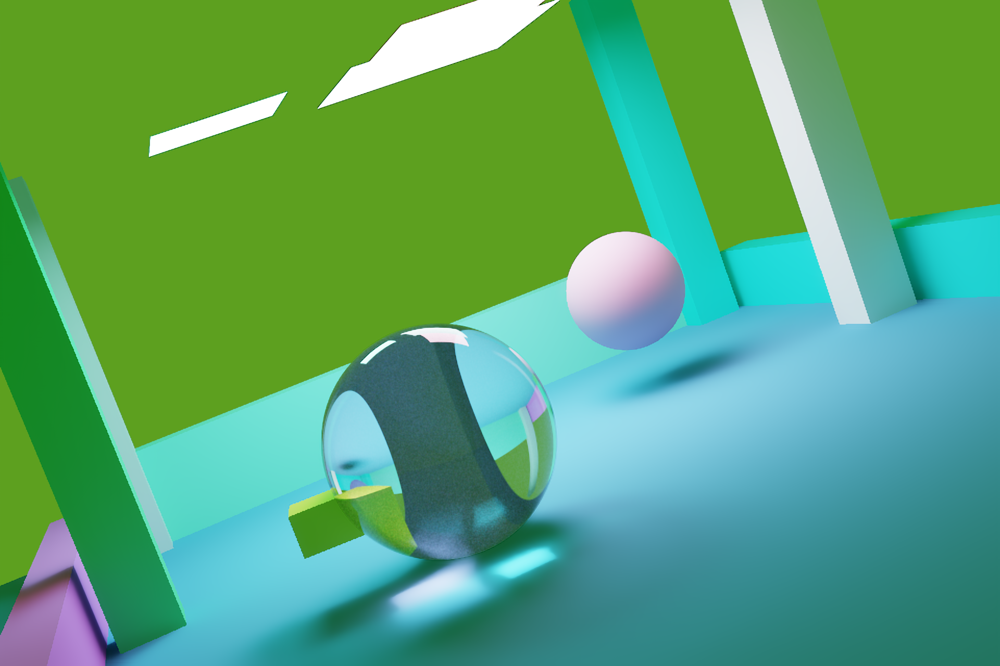
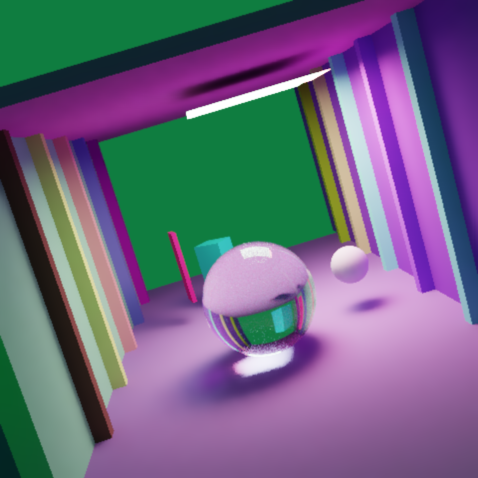
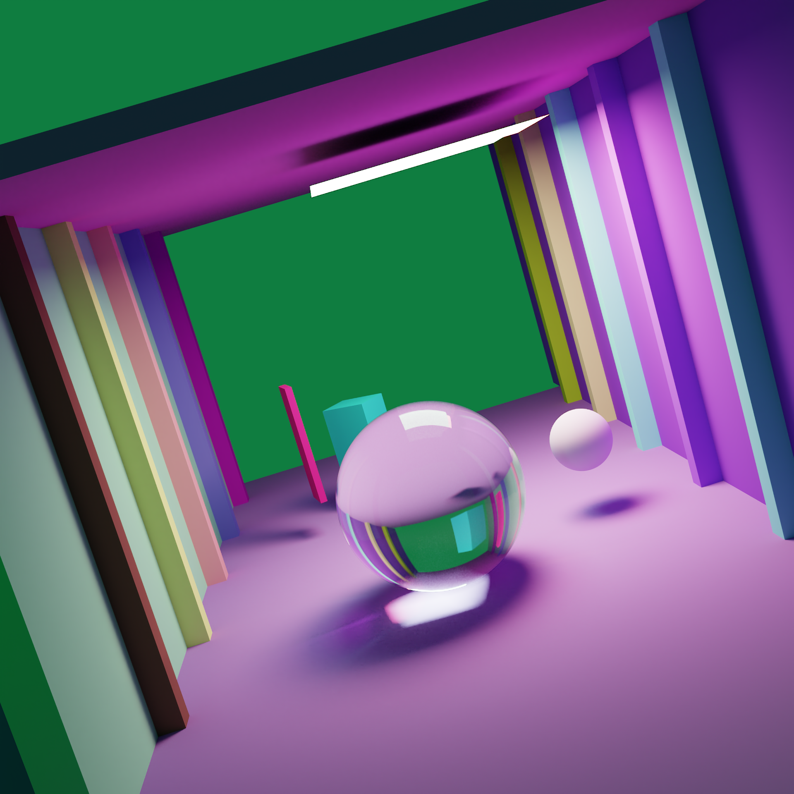
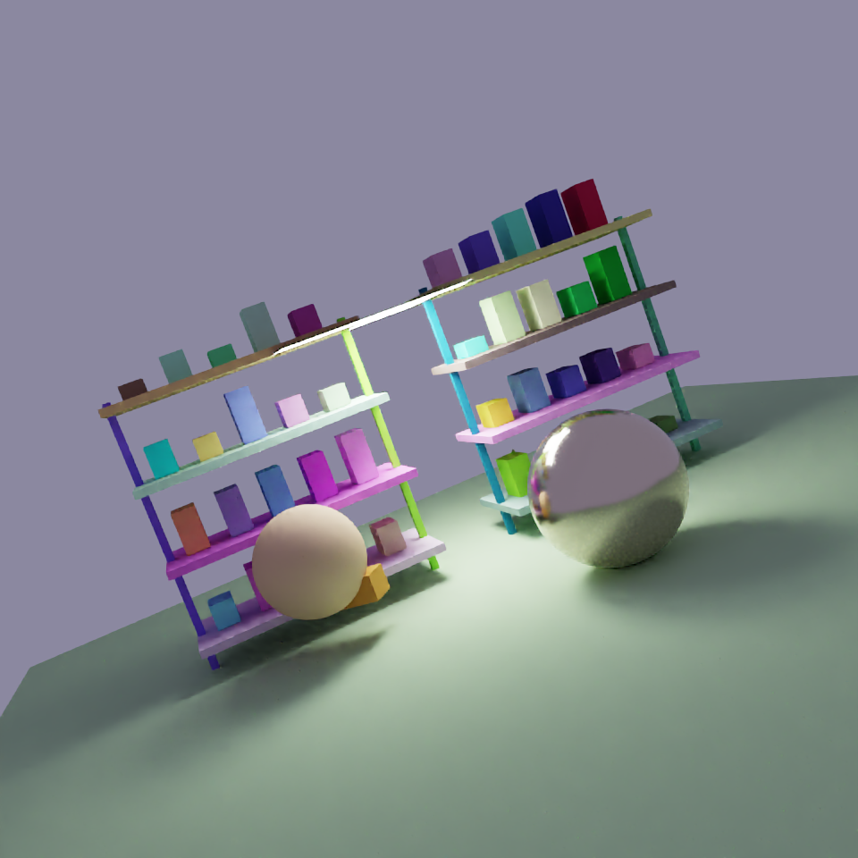
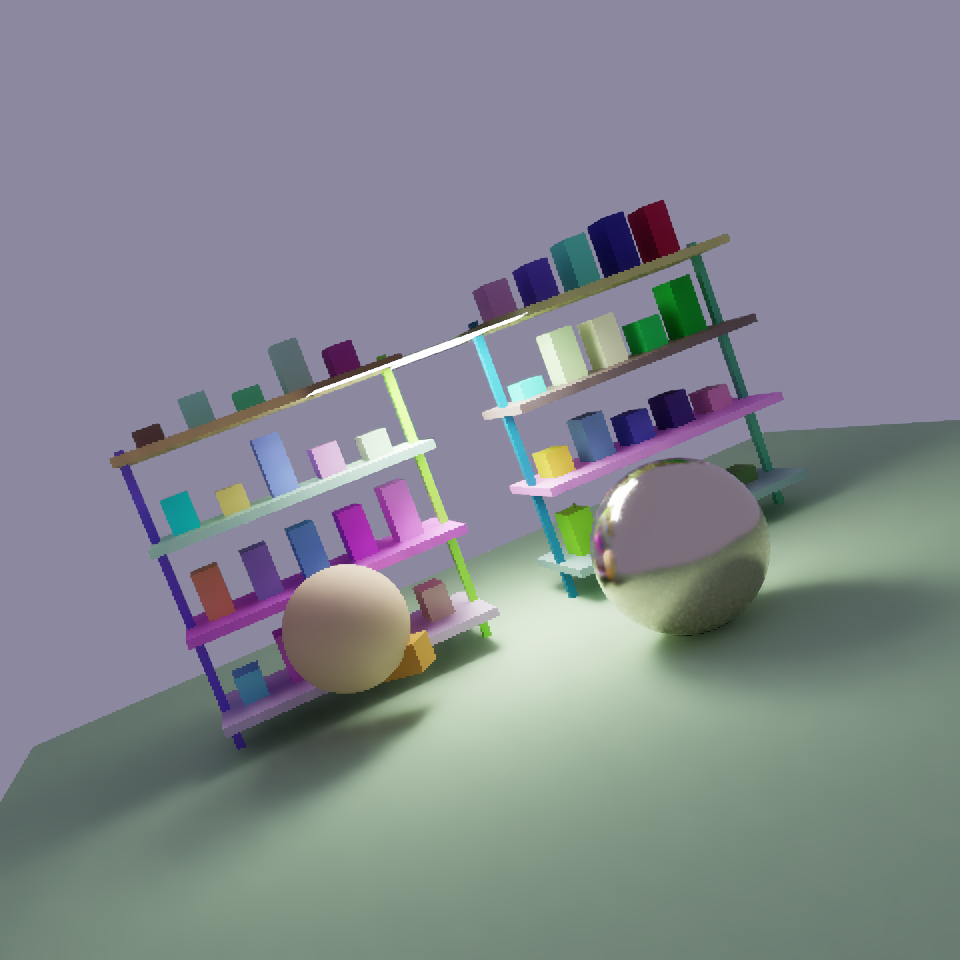

# Joint denoising and 2× reconstruction results

The Mac training study completed **69 epochs**, stopping after ten epochs without
improvement in the checkpoint selection score. **Epoch 59 is the selected best**.
The initial 50-epoch schedule finished; a lower-learning-rate extension targeted
100 total epochs and retained early stopping. Best/latest and full epoch checkpoints
are retained locally. These figures show the trained development model, not the
older bundled diffuse pilot model.

The 508,172-parameter model learned from **59,992 reused examples**: 57,344 synthetic
area-reduced pairs and 2,648 native 2× pairs. The split contains 44,376 training,
7,808 validation and 7,808 sealed-test examples. Epoch validation measures 3,904
first-noise examples: 3,584 synthetic and 320 native, plus 576 preservation views.
Training reused existing renders. The later HD gallery below uses six new renders
of the same selected scene configurations, without modifying the training dataset. See the
[reuse contract](../../docs/joint-reuse-training.md) for provenance and limitations.

**Full quality qualification has not passed.** Native low-sample reconstruction
and some resolution-specific checks remain below requirements. These are validation
results from one training seed, not a sealed-test result or proof of rendering speedup.
The current model has not replaced the bundled pilot export.

## Example images

Each scene has **ten separate, individually labeled images** below. Click any
image to inspect its native-resolution PNG. All use ACES-fit/sRGB at exposure zero.
The reference and low-sample reconstructions are 960 pixels wide; full-render AI
variants are 1,920 pixels wide. GitHub fits each image to the document width without
changing the linked original. Spp means samples per pixel.

The gallery now uses **fresh 480-pixel-wide, 64-spp inputs** and independent
**960-pixel-wide, 2,048-spp references**. These replace the earlier enlarged
128–192-pixel validation thumbnails. Scene configurations and seeds are preserved;
examples were not selected by score. These higher-resolution renders are a separate
illustration and are not included in the historical training validation metrics.
The denoiser here is a-trous, not OIDN or DLSS.

### Courtyard · 64 spp · 480 × 320 → 960 × 640

**1. 64-spp input + bilinear 2×**

[](figures/joint-epoch59-courtyard-hd-noisy.png)

**2. A-trous + bilinear 2×**

[](figures/joint-epoch59-courtyard-hd-atrous.png)

**3. Full render · 2,048 spp**

[](figures/joint-epoch59-courtyard-hd-reference.png)

**4. AI reconstruction · epoch 59**

[](figures/joint-epoch59-courtyard-hd-epoch59.png)

**5. AI → a-trous**

[](figures/joint-epoch59-courtyard-hd-ai-atrous.png)

**6. A-trous → AI**

[](figures/joint-epoch59-courtyard-hd-atrous-ai.png)

**7. Full render → AI**

[](figures/joint-epoch59-courtyard-hd-full-render-ai.png)

**8. Full render → a-trous**

[](figures/joint-epoch59-courtyard-hd-full-render-atrous.png)

**9. Full render → a-trous → AI**

[](figures/joint-epoch59-courtyard-hd-full-render-atrous-ai.png)

**10. Full render → AI → a-trous**

[](figures/joint-epoch59-courtyard-hd-full-render-ai-atrous.png)

At this resolution, the AI cleans the floor and recovers column boundaries, but
glass and reflected light retain mottled artifacts. The actual high-sample render
resolves those surfaces more consistently. Enlarging the old validation thumbnails
could not reveal this distinction reliably.

### Corridor · 64 spp · 480 × 480 → 960 × 960

**1. 64-spp input + bilinear 2×**

[](figures/joint-epoch59-corridor-hd-noisy.png)

**2. A-trous + bilinear 2×**

[](figures/joint-epoch59-corridor-hd-atrous.png)

**3. Full render · 2,048 spp**

[](figures/joint-epoch59-corridor-hd-reference.png)

**4. AI reconstruction · epoch 59**

[](figures/joint-epoch59-corridor-hd-epoch59.png)

**5. AI → a-trous**

[](figures/joint-epoch59-corridor-hd-ai-atrous.png)

**6. A-trous → AI**

[](figures/joint-epoch59-corridor-hd-atrous-ai.png)

**7. Full render → AI**

[](figures/joint-epoch59-corridor-hd-full-render-ai.png)

**8. Full render → a-trous**

[](figures/joint-epoch59-corridor-hd-full-render-atrous.png)

**9. Full render → a-trous → AI**

[](figures/joint-epoch59-corridor-hd-full-render-atrous-ai.png)

**10. Full render → AI → a-trous**

[](figures/joint-epoch59-corridor-hd-full-render-ai-atrous.png)

The AI retains the corridor's column structure and reduces noise, while glass
reflections and the bright patch beneath the sphere still differ from the full
render. The score averages the whole image, including its large flat regions.

### Shelves · 64 spp · 480 × 480 → 960 × 960

**1. 64-spp input + bilinear 2×**

[](figures/joint-epoch59-shelves-hd-noisy.png)

**2. A-trous + bilinear 2×**

[](figures/joint-epoch59-shelves-hd-atrous.png)

**3. Full render · 2,048 spp**

[](figures/joint-epoch59-shelves-hd-reference.png)

**4. AI reconstruction · epoch 59**

[](figures/joint-epoch59-shelves-hd-epoch59.png)

**5. AI → a-trous**

[](figures/joint-epoch59-shelves-hd-ai-atrous.png)

**6. A-trous → AI**

[](figures/joint-epoch59-shelves-hd-atrous-ai.png)

**7. Full render → AI**

[](figures/joint-epoch59-shelves-hd-full-render-ai.png)

**8. Full render → a-trous**

[](figures/joint-epoch59-shelves-hd-full-render-atrous.png)

**9. Full render → a-trous → AI**

[](figures/joint-epoch59-shelves-hd-full-render-atrous-ai.png)

**10. Full render → AI → a-trous**

[](figures/joint-epoch59-shelves-hd-full-render-ai-atrous.png)

Scores are PSNR / SSIM; higher is better.

| Example | A-trous | AI | AI → a-trous | A-trous → AI |
| --- | ---: | ---: | ---: | ---: |
| Courtyard, 64 spp | 27.98 dB / 0.9293 | 33.99 dB / 0.9524 | 32.65 dB / 0.9512 | 32.46 dB / 0.9516 |
| Corridor, 64 spp | 30.56 dB / 0.9475 | 37.51 dB / 0.9654 | 33.84 dB / 0.9550 | 34.02 dB / 0.9589 |
| Shelves, 64 spp | 33.28 dB / 0.9667 | 39.14 dB / 0.9828 | 35.72 dB / 0.9735 | 36.13 dB / 0.9750 |

### Individual images at native output size

The base reference and low-sample reconstructions are 960 pixels wide. Full-render
AI variants are 1,920 pixels wide. These links open the original PNGs at their native dimensions.

| Scene | Raw + 2× | A-trous + 2× | AI | AI → a-trous | A-trous → AI |
| --- | --- | --- | --- | --- | --- |
| Courtyard | [PNG](figures/joint-epoch59-courtyard-hd-noisy.png) | [PNG](figures/joint-epoch59-courtyard-hd-atrous.png) | [PNG](figures/joint-epoch59-courtyard-hd-epoch59.png) | [PNG](figures/joint-epoch59-courtyard-hd-ai-atrous.png) | [PNG](figures/joint-epoch59-courtyard-hd-atrous-ai.png) |
| Corridor | [PNG](figures/joint-epoch59-corridor-hd-noisy.png) | [PNG](figures/joint-epoch59-corridor-hd-atrous.png) | [PNG](figures/joint-epoch59-corridor-hd-epoch59.png) | [PNG](figures/joint-epoch59-corridor-hd-ai-atrous.png) | [PNG](figures/joint-epoch59-corridor-hd-atrous-ai.png) |
| Shelves | [PNG](figures/joint-epoch59-shelves-hd-noisy.png) | [PNG](figures/joint-epoch59-shelves-hd-atrous.png) | [PNG](figures/joint-epoch59-shelves-hd-epoch59.png) | [PNG](figures/joint-epoch59-shelves-hd-ai-atrous.png) | [PNG](figures/joint-epoch59-shelves-hd-atrous-ai.png) |

### Post-denoising procedure

The fifth panel applies the existing `raytracer_ml.data.resample.atrous` filter
with **three iterations** to the AI's linear HDR output at its predicted resolution.
Center albedo, normal, depth and validity guides are enlarged 2× from the noisy
input using nearest-neighbor replication. No high-resolution reference guides or
extra rays are used. These replicated guides cannot supply missing subpixel geometry.
The filter reads predicted radiance and these guides; it does not treat the input's
noise variance as a calibrated estimate of AI residual error.

The same fixed settings were used for all three examples, without tuning against
their scores. This is an illustration, not a new default inference mode. The training charts below
still measure **AI alone**, and no broader quality or latency claim is made for this
post-processing experiment.

### Pre-denoising procedure

The sixth panel feeds the saved input-resolution a-trous result to the unchanged
epoch-59 model, replacing only RGB channels 0–2. All geometry/material guides and
original sampling statistics stay unchanged. The AI then reconstructs at 2×
resolution. Neither filter nor model receives reference pixels or reference guides.

The model was trained on noisy RGB inputs, not these pre-denoised inputs. This is
an inference-only experiment with a changed input distribution; the retained
sampling statistics describe the original samples, not the filter's residual error.
It is not a separately trained denoise-then-upscale model.

The table above measures these newly rendered HD examples, not the previous
small-image gallery. Training charts retain the original validation range and
measure AI alone. Neither these three views nor their processing combinations
establish a general quality or timing advantage.

## Full-render processing diagnostics

The final four panels start from the newly rendered **2,048-spp reference itself**, using
its own full-resolution measured feature buffers. They show what additional
processing does to an already high-sample render; they are excluded from all
reconstruction scores and training charts. The base render required new rays;
these processing steps required no further rendering or training.

**Full render → AI** uses the unchanged epoch-59 model and produces another 2×
upscale: 1,920 × 1,280 for courtyard and 1,920 × 1,920 for corridor and shelves.
Each separate PNG preserves the actual AI output pixels; it is not downsampled to the reference dimensions.
A 2,048-spp input is outside this model's training sample-budget range, so these
panels do not establish quality at that resolution or a rendering speedup.

**Full render → a-trous** applies three filter iterations at the original reference
resolution with its own center albedo, normal, depth and validity guides. It can
smooth remaining noise and also soften fine detail.

**Full render → a-trous → AI** first filters the full-resolution linear HDR
render with three a-trous iterations, then replaces only the RGB channels in its
feature buffers and runs the unchanged epoch-59 model. Full-render geometry and
sampling statistics are retained. This input is both higher-sample and pre-denoised,
unlike the noisy inputs used for training.

**Full render → AI → a-trous** first runs the same AI model on the full render,
then filters its linear HDR prediction with three iterations at the AI's actual
output resolution. Guides are nearest-neighbor 2× replications of the full render's
center albedo, normal, depth and validity. Filtering happens at the actual AI output resolution;
replicated guides cannot provide new subpixel geometry or calibrated AI-error variance.

Both sequences produce the same output dimensions as full render → AI and are saved individually at their native output sizes. Full-size PNGs are linked below. They remain
reference-fed diagnostics, with no reconstruction scores or timing claims.

| Scene | Full render → AI | Full render → a-trous | Full render → a-trous → AI | Full render → AI → a-trous |
| --- | --- | --- | --- | --- |
| Courtyard | [PNG](figures/joint-epoch59-courtyard-hd-full-render-ai.png) | [PNG](figures/joint-epoch59-courtyard-hd-full-render-atrous.png) | [PNG](figures/joint-epoch59-courtyard-hd-full-render-atrous-ai.png) | [PNG](figures/joint-epoch59-courtyard-hd-full-render-ai-atrous.png) |
| Corridor | [PNG](figures/joint-epoch59-corridor-hd-full-render-ai.png) | [PNG](figures/joint-epoch59-corridor-hd-full-render-atrous.png) | [PNG](figures/joint-epoch59-corridor-hd-full-render-atrous-ai.png) | [PNG](figures/joint-epoch59-corridor-hd-full-render-ai-atrous.png) |
| Shelves | [PNG](figures/joint-epoch59-shelves-hd-full-render-ai.png) | [PNG](figures/joint-epoch59-shelves-hd-full-render-atrous.png) | [PNG](figures/joint-epoch59-shelves-hd-full-render-atrous-ai.png) | [PNG](figures/joint-epoch59-shelves-hd-full-render-ai-atrous.png) |

## Training and remaining quality gaps


The dotted line marks the schedule extension after epoch 50: learning rate renewed
at 0.00003 with a 50-epoch cosine schedule. Model weights, optimizer moments, random
state, global step, selection policy and patience were preserved. The selected best
is epoch 59; training stopped at epoch 69. Loss improvements slowed substantially.
HDR error varied during training, especially before the extension.


Each budget contains 64 native validation images. Quality targets are 30 dB PSNR
and 0.95 SSIM, plus baseline-relative HDR, edge and preservation requirements and
checks by resolution and sample count. Passing a budget average is insufficient
for overall qualification. Synthetic averages must not conceal weaker native results.

Epoch 59 averages **29.82 dB / 0.9173 SSIM** on native 2× validation, against
**25.98 dB / 0.8768** for a-trous plus bilinear enlargement. This improves on that
baseline but still misses the absolute native quality target. Low-sample inputs,
glass/reflections, small structures and crisp boundaries remain limitations.
Total tracing, preprocessing and inference latency has not been qualified for this model.

## Data and reproducibility

- [69-epoch chart data](joint-training-history.json): aggregate, native/synthetic
  and budget metrics, learning rates, selection history and eligibility.
- [HD example metadata and exact scores](joint-examples.json): render settings,
  reference, renderer and checkpoint SHA-256 hashes, display and selection policies.
- [HD gallery generator](../../scripts/render_joint_gallery.py) and committed
  [scene configurations](gallery-scenes): six actual renders, all ten processing
  methods and native-size PNGs. Requires the local epoch-59 checkpoint and ML environment.
- [Chart generator](../../scripts/plot_joint_results.py): run with Python and
  `matplotlib==3.10.6`; reads committed metrics and requires no renderer or SSD.
- Parent training source: `745ecbbb136a59045f51cbf42e410f7c2f2d1811`.
- Extension and inference source: `de7e2eb0a086e36b700c59ac8a9f81d4334189ca`.

To regenerate the HD gallery with the local epoch-59 checkpoint:

```sh
cmake --build build -j 8
PYTHONPATH=ml/src ml/.venv/bin/python scripts/render_joint_gallery.py \
  --checkpoint /path/to/epoch-000059.pt
```

The script validates a tiny schema-2 feature export before expensive rendering.
Use `--assemble-only` to reuse completed HDR renders in `artifacts/gallery-hd`.
The working HDR buffers and checkpoint stay local; native PNGs, scene configurations
and recorded metrics are committed. Rendering takes several minutes per scene on
this Mac at 2,048 spp.

From the repository root, regenerate the charts with:

```sh
python scripts/plot_joint_results.py
```

The image arrays, datasets and full training checkpoints remain local; this report
commits presentation images and numerical evidence. The earlier diffuse pilot's
[model card](model_card.md) and [timing report](timing.md) describe a separate experiment.
