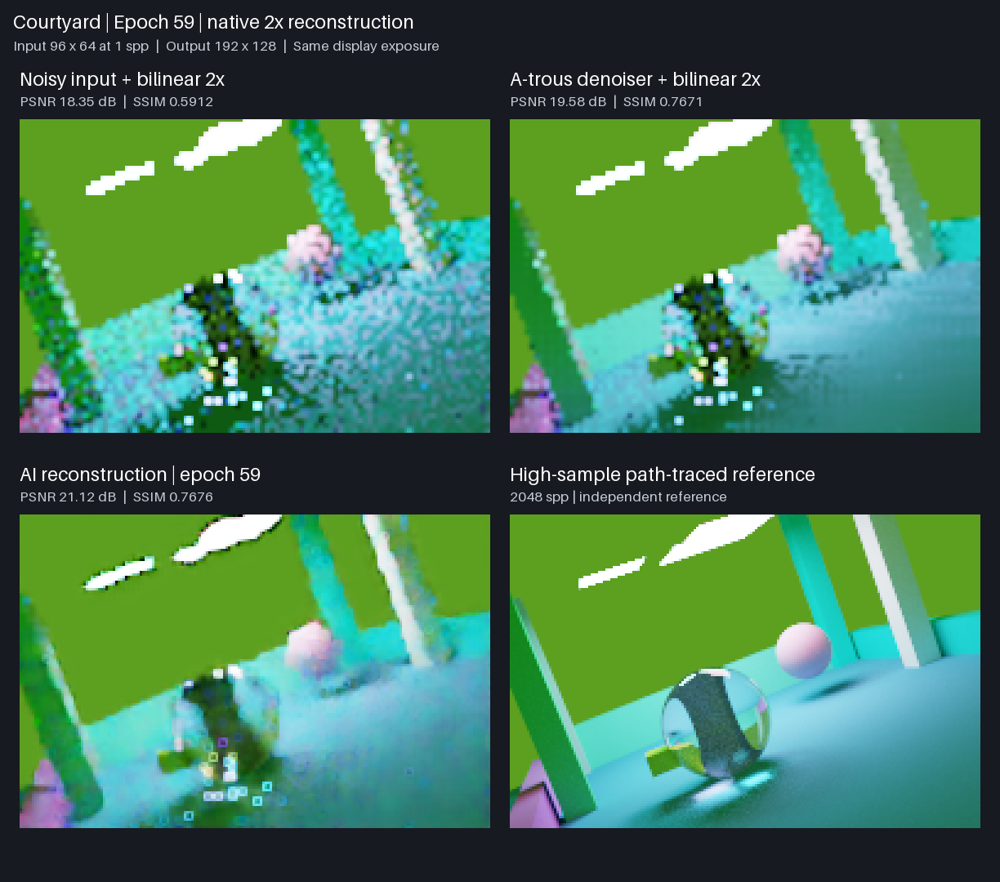
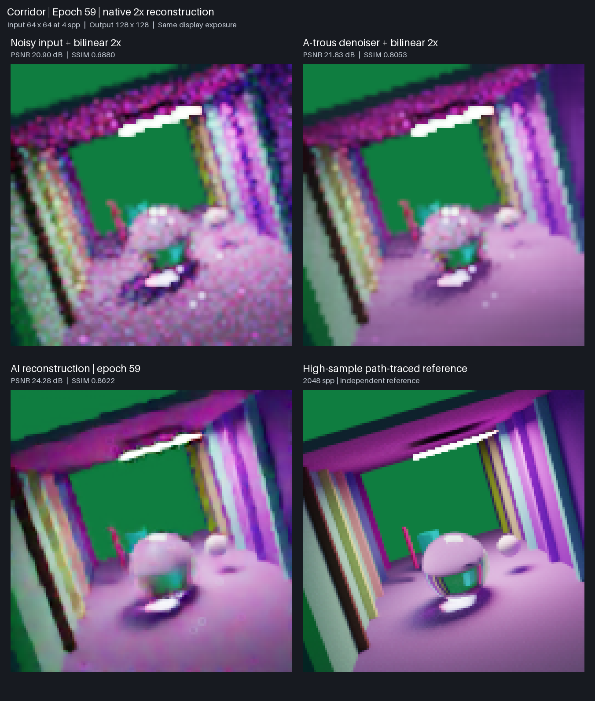
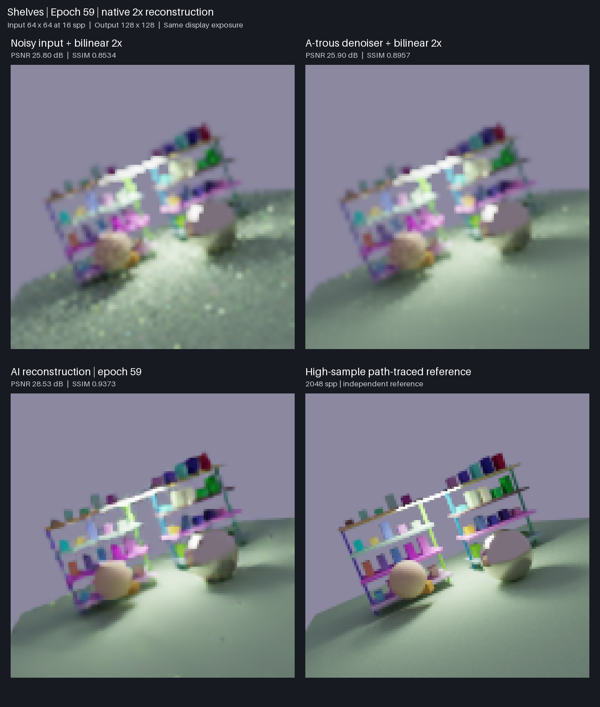

# Joint denoising and 2× reconstruction results

The Mac training study completed **69 epochs**, stopping after ten epochs without
improvement in the checkpoint selection score. **Epoch 59 is the selected best**.
The initial 50-epoch schedule finished; a lower-learning-rate extension targeted
100 total epochs and retained early stopping. Best/latest and full epoch checkpoints
are retained locally. These figures show the trained development model, not the
older bundled diffuse pilot model.

The 508,172-parameter model learned from **59,992 reused examples**: 57,344 synthetic
area-reduced pairs and 2,648 native 2× pairs. The split contains 44,376 training,
7,808 validation and 7,808 sealed-test examples. Epoch validation measures 3,904
first-noise examples: 3,584 synthetic and 320 native, plus 576 preservation views.
No new renders were generated for this study or gallery. See the
[reuse contract](../../docs/joint-reuse-training.md) for provenance and limitations.

**Full quality qualification has not passed.** Native low-sample reconstruction
and some resolution-specific checks remain below requirements. These are validation
results from one training seed, not a sealed-test result or proof of rendering speedup.
The current model has not replaced the bundled pilot export.

## Example images

Every grid uses the same order: noisy input with bilinear 2× enlargement, a-trous
denoising with bilinear 2× enlargement, epoch-59 learned reconstruction, and an
independent **2,048-spp reference** at the target resolution. All panels use the
same ACES-fit/sRGB transform at exposure zero, with nearest-neighbor magnification
for inspection. The model performs actual 2× reconstruction; display magnification
does not add detail. Spp means samples per pixel.

Examples were selected by metadata before inference: the first native validation
manifest row for courtyard/1 spp, corridor/4 spp and shelves/16 spp. They were not
chosen by model score. Different scenes and resolutions mean this gallery is not
a controlled sample-count sweep. The denoiser here is a-trous, not OIDN or DLSS.

### Courtyard · 1 spp · 96 × 64 → 192 × 128



The AI reduces noise, but the glass object and reflections remain inaccurate.
Its SSIM is almost tied with the denoiser on this example.

### Corridor · 4 spp · 64 × 64 → 128 × 128



The AI improves the columns and lighting; thin structures, reflections and sharp
edges remain softer than the reference.

### Shelves · 16 spp · 64 × 64 → 128 × 128



The AI produces cleaner surfaces and more distinct objects, with residual blur on
small shelf details.

| Example | A-trous PSNR / SSIM | AI PSNR / SSIM |
| --- | ---: | ---: |
| Courtyard, 1 spp | 19.58 dB / 0.7671 | 21.12 dB / 0.7676 |
| Corridor, 4 spp | 21.83 dB / 0.8053 | 24.28 dB / 0.8622 |
| Shelves, 16 spp | 25.90 dB / 0.8957 | 28.53 dB / 0.9373 |

## Training and remaining quality gaps


The dotted line marks the schedule extension after epoch 50: learning rate renewed
at 0.00003 with a 50-epoch cosine schedule. Model weights, optimizer moments, random
state, global step, selection policy and patience were preserved. The selected best
is epoch 59; training stopped at epoch 69. Loss improvements slowed substantially.
HDR error varied during training, especially before the extension.


Each budget contains 64 native validation images. Quality targets are 30 dB PSNR
and 0.95 SSIM, plus baseline-relative HDR, edge and preservation requirements and
checks by resolution and sample count. Passing a budget average is insufficient
for overall qualification. Synthetic averages must not conceal weaker native results.

Epoch 59 averages **29.82 dB / 0.9173 SSIM** on native 2× validation, against
**25.98 dB / 0.8768** for a-trous plus bilinear enlargement. This improves on that
baseline but still misses the absolute native quality target. Low-sample inputs,
glass/reflections, small structures and crisp boundaries remain limitations.
Total tracing, preprocessing and inference latency has not been qualified for this model.

## Data and reproducibility

- [69-epoch chart data](joint-training-history.json): aggregate, native/synthetic
  and budget metrics, learning rates, selection history and eligibility.
- [Example metadata and exact scores](joint-examples.json): IDs, reference and
  checkpoint SHA-256 hashes, display policy and selection procedure.
- [Chart generator](../../scripts/plot_joint_results.py): run with Python and
  `matplotlib==3.10.6`; reads committed metrics and requires no renderer or SSD.
- Parent training source: `745ecbbb136a59045f51cbf42e410f7c2f2d1811`.
- Extension and inference source: `de7e2eb0a086e36b700c59ac8a9f81d4334189ca`.

From the repository root, regenerate the charts with:

```sh
python scripts/plot_joint_results.py
```

The image arrays, datasets and full training checkpoints remain local; this report
commits presentation images and numerical evidence. The earlier diffuse pilot's
[model card](model_card.md) and [timing report](timing.md) describe a separate experiment.
