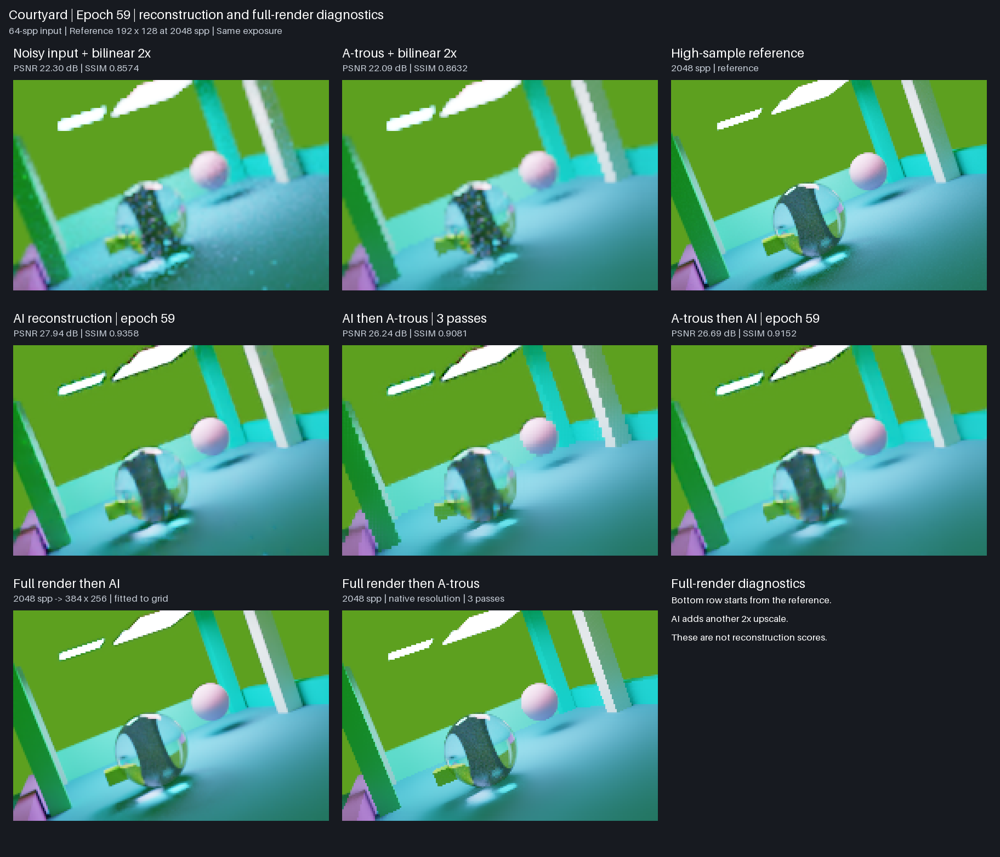
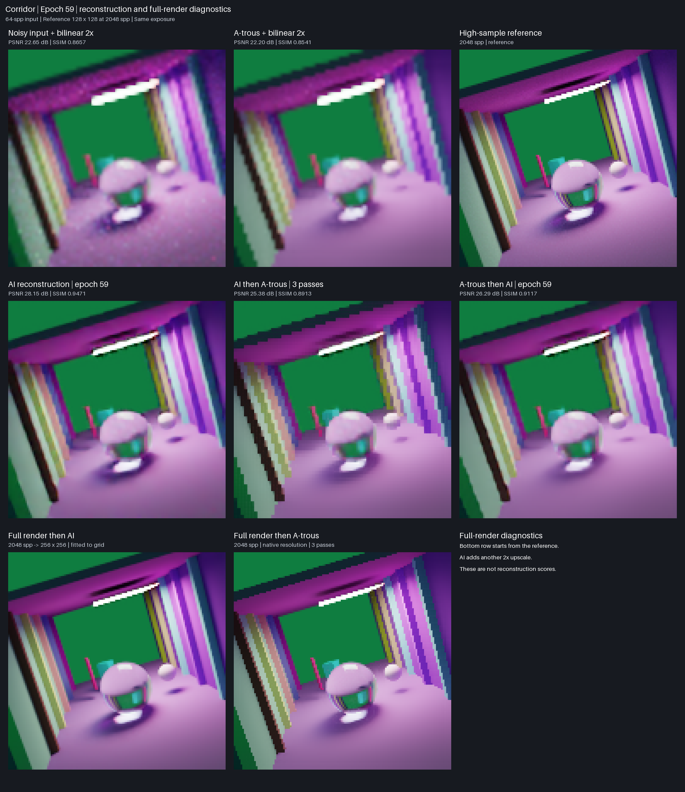
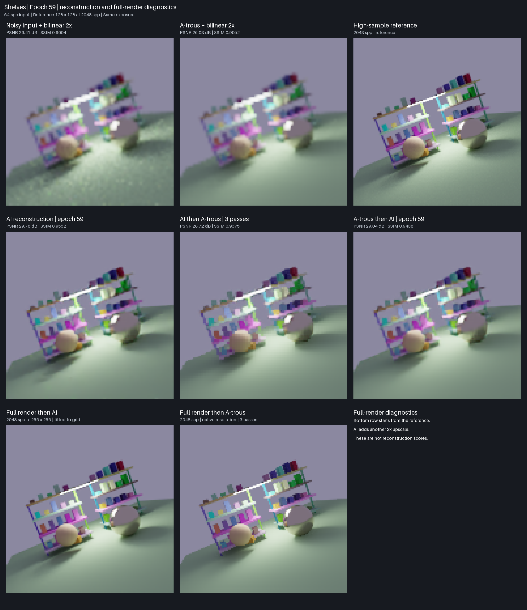
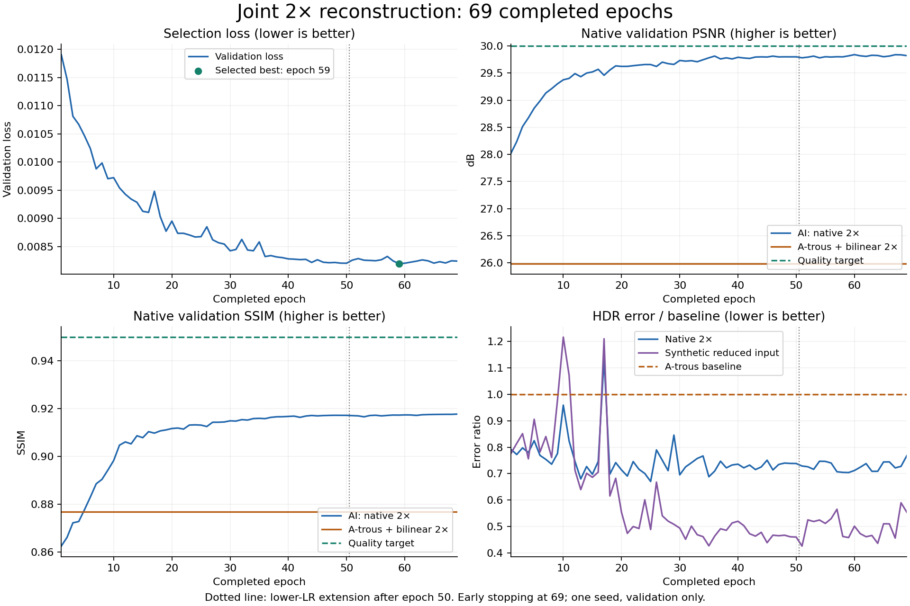

# Joint denoising and 2× reconstruction results

The Mac training study completed **69 epochs**, stopping after ten epochs without
improvement in the checkpoint selection score. **Epoch 59 is the selected best**.
The initial 50-epoch schedule finished; a lower-learning-rate extension targeted
100 total epochs and retained early stopping. Best/latest and full epoch checkpoints
are retained locally. These figures show the trained development model, not the
older bundled diffuse pilot model.

The 508,172-parameter model learned from **59,992 reused examples**: 57,344 synthetic
area-reduced pairs and 2,648 native 2× pairs. The split contains 44,376 training,
7,808 validation and 7,808 sealed-test examples. Epoch validation measures 3,904
first-noise examples: 3,584 synthetic and 320 native, plus 576 preservation views.
No new renders were generated for this study or gallery. See the
[reuse contract](../../docs/joint-reuse-training.md) for provenance and limitations.

**Full quality qualification has not passed.** Native low-sample reconstruction
and some resolution-specific checks remain below requirements. These are validation
results from one training seed, not a sealed-test result or proof of rendering speedup.
The current model has not replaced the bundled pilot export.

## Example images

Every grid contains eight images. The top row shows noisy input with bilinear 2×
enlargement, a-trous denoising with bilinear 2× enlargement, and an independent
**2,048-spp reference** at the target resolution. The middle row shows epoch-59
learned reconstruction, that same prediction followed by a-trous denoising, and
a-trous denoising followed by the same AI model. The bottom row adds full-render
processing with AI and a-trous, described below. All panels use the
same ACES-fit/sRGB transform at exposure zero, with nearest-neighbor magnification
for inspection. The model performs actual 2× reconstruction; display magnification
does not add detail. Spp means samples per pixel.

The gallery uses existing **64-spp inputs** for the same three scene configurations
and independent references selected for the original gallery. The original scenes
were chosen by metadata before inference, not by model score; their sample budget
was increased for a cleaner visual comparison. No images were re-rendered. Different
scenes and resolutions mean this gallery is not a controlled sample-count sweep.
The denoiser here is a-trous, not OIDN or DLSS.

### Courtyard · 64 spp · 96 × 64 → 192 × 128



The AI reduces noise, but the glass object and reflections remain inaccurate.
AI alone has higher PSNR and SSIM than a-trous and either combined pipeline;
the glass object still differs from the reference.

### Corridor · 64 spp · 64 × 64 → 128 × 128



The AI improves the columns and lighting; thin structures, reflections and sharp
edges remain softer than the reference. Both combined pipelines reduce PSNR and SSIM compared with AI alone.

### Shelves · 64 spp · 64 × 64 → 128 × 128



The AI produces cleaner surfaces and more distinct objects, with residual blur on
small shelf details. Both combined pipelines reduce PSNR and SSIM compared with AI alone.

Scores are PSNR / SSIM; higher is better.

| Example | A-trous | AI | AI → a-trous | A-trous → AI |
| --- | ---: | ---: | ---: | ---: |
| Courtyard, 64 spp | 22.09 dB / 0.8632 | 27.94 dB / 0.9358 | 26.24 dB / 0.9081 | 26.69 dB / 0.9152 |
| Corridor, 64 spp | 22.20 dB / 0.8541 | 28.15 dB / 0.9471 | 25.38 dB / 0.8913 | 26.29 dB / 0.9117 |
| Shelves, 64 spp | 26.08 dB / 0.9052 | 29.78 dB / 0.9552 | 28.72 dB / 0.9375 | 29.04 dB / 0.9438 |

### Post-denoising procedure

The fifth panel applies the existing `raytracer_ml.data.resample.atrous` filter
with **three iterations** to the AI's linear HDR output at its predicted resolution.
Center albedo, normal, depth and validity guides are enlarged 2× from the noisy
input using nearest-neighbor replication. No high-resolution reference guides or
extra rays are used. These replicated guides cannot supply missing subpixel geometry.
The filter reads predicted radiance and these guides; it does not treat the input's
noise variance as a calibrated estimate of AI residual error.

The same fixed settings were used for all three examples, without tuning against
their scores. Post-denoising reduces PSNR and SSIM in all three 64-spp examples;
it is an illustration, not a new default inference mode. The training charts below
still measure **AI alone**, and no broader quality or latency claim is made for this
post-processing experiment.

### Pre-denoising procedure

The sixth panel feeds the saved input-resolution a-trous result to the unchanged
epoch-59 model, replacing only RGB channels 0–2. All geometry/material guides and
original sampling statistics stay unchanged. The AI then reconstructs at 2×
resolution. Neither filter nor model receives reference pixels or reference guides.

The model was trained on noisy RGB inputs, not these pre-denoised inputs. This is
an inference-only experiment with a changed input distribution; the retained
sampling statistics describe the original samples, not the filter's residual error.
It is not a separately trained denoise-then-upscale model.

On these 64-spp examples, AI alone has the highest PSNR and SSIM of the compared
methods. Pre-denoising also reduces both metrics compared with AI alone. These
three comparisons do not qualify either combination as a new default or establish
a timing advantage. The training charts retain the full original validation
sample-budget range and measure AI alone; they are unchanged by this gallery update.

## Full-render processing diagnostics

The final two panels start from the existing **2,048-spp reference itself**, using
its own full-resolution measured feature buffers. They show what additional
processing does to an already high-sample render; they are excluded from all
reconstruction scores and training charts. No new rays or training were required.

**Full render → AI** uses the unchanged epoch-59 model and produces another 2×
upscale: 384 × 256 for courtyard and 256 × 256 for corridor and shelves. The grid
area-reduces that output to the reference dimensions before common display
magnification. The full-size outputs below preserve the actual AI output pixels.
A 2,048-spp input is outside this model's training sample-budget range, so these
panels do not establish quality at that resolution or a rendering speedup.

**Full render → a-trous** applies three filter iterations at the original reference
resolution with its own center albedo, normal, depth and validity guides. It can
smooth remaining noise and also soften fine detail.

| Scene | Full render → AI, original output size | Full render → a-trous |
| --- | --- | --- |
| Courtyard | [PNG](figures/joint-epoch59-courtyard-64spp-full-render-ai.png) | [PNG](figures/joint-epoch59-courtyard-64spp-full-render-atrous.png) |
| Corridor | [PNG](figures/joint-epoch59-corridor-64spp-full-render-ai.png) | [PNG](figures/joint-epoch59-corridor-64spp-full-render-atrous.png) |
| Shelves | [PNG](figures/joint-epoch59-shelves-64spp-full-render-ai.png) | [PNG](figures/joint-epoch59-shelves-64spp-full-render-atrous.png) |

## Training and remaining quality gaps



The dotted line marks the schedule extension after epoch 50: learning rate renewed
at 0.00003 with a 50-epoch cosine schedule. Model weights, optimizer moments, random
state, global step, selection policy and patience were preserved. The selected best
is epoch 59; training stopped at epoch 69. Loss improvements slowed substantially.
HDR error varied during training, especially before the extension.


Each budget contains 64 native validation images. Quality targets are 30 dB PSNR
and 0.95 SSIM, plus baseline-relative HDR, edge and preservation requirements and
checks by resolution and sample count. Passing a budget average is insufficient
for overall qualification. Synthetic averages must not conceal weaker native results.

Epoch 59 averages **29.82 dB / 0.9173 SSIM** on native 2× validation, against
**25.98 dB / 0.8768** for a-trous plus bilinear enlargement. This improves on that
baseline but still misses the absolute native quality target. Low-sample inputs,
glass/reflections, small structures and crisp boundaries remain limitations.
Total tracing, preprocessing and inference latency has not been qualified for this model.

## Data and reproducibility

- [69-epoch chart data](joint-training-history.json): aggregate, native/synthetic
  and budget metrics, learning rates, selection history and eligibility.
- [Example metadata and exact scores](joint-examples.json): IDs, reference and
  checkpoint SHA-256 hashes, display policy and selection procedure.
- [Chart generator](../../scripts/plot_joint_results.py): run with Python and
  `matplotlib==3.10.6`; reads committed metrics and requires no renderer or SSD.
- Parent training source: `745ecbbb136a59045f51cbf42e410f7c2f2d1811`.
- Extension and inference source: `de7e2eb0a086e36b700c59ac8a9f81d4334189ca`.

From the repository root, regenerate the charts with:

```sh
python scripts/plot_joint_results.py
```

The image arrays, datasets and full training checkpoints remain local; this report
commits presentation images and numerical evidence. The earlier diffuse pilot's
[model card](model_card.md) and [timing report](timing.md) describe a separate experiment.
