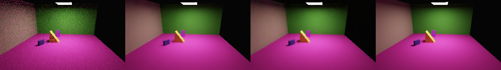

# OIDN training control

Status: 200-epoch development control and full pilot validation completed; no
qualified release weights from this experiment yet.
This trains a randomly initialized upstream network on our renderer's data.
It is distinct from the pretrained OIDN comparisons in the historical model card.
See the [research audit](../../docs/neural-reconstruction-research-audit.md).

## Protocol

The source is unmodified [OIDN v2.5.1](https://github.com/RenderKit/oidn/tree/v2.5.1),
commit `6602ee2ca38a1a2a02135beed8f6e68eed630180`. The launcher records its training
file hashes and rejects a different or dirty checkout. Its isolated Mac environment
uses Python 3.12.11, Torch 2.14.0, OpenImageIO 3.1.17.0 and TensorBoard 2.21.0.
MPS is present in the source but is not covered by the README's Linux-only training
support statement. Locally successful execution is the relevant evidence here.

The pilot export contains all 448 training and 224 validation examples from
`detail-pilot-v2`, manifest
`e782c0dccf9ab0c47169e8bf2ffc8f6e5b3c0f038e2f49c916e58ee42e236894`.
The exporter verifies source checksums and split isolation, writes float32 linear
HDR/albedo/normal EXRs, and records each source-to-export mapping and output hash.
It preserves sampled normals, including their signs and unnormalized means. The
training and deployment guides are noisy; `clean_aux` is false. References remain
independent raw renders. Test examples are excluded from this export.

Upstream preprocessing supplies its PU HDR transform and memory-mapped TZA files.
No image resizing or target-guide substitution is performed. The 256×144 source
images require a **small-image adaptation**: 128×128 patches and the supported
`l1_grad` loss, not the default five-scale MS-SSIM mixture. The separate
`detail-pilot-512.yaml` configuration renders the same layouts at 512×288 for a
later default-loss study using 256×256 crops. The two resolutions are related data,
not independent scene cohorts.

The initial control uses upstream balanced U-Net, batch 8, FP32, Adam, 200 epochs
(11,200 training updates if uninterrupted), validation/checkpoints every five epochs,
and one-cycle cosine scheduling. This is not a matched-compute comparison with
the 50-epoch custom screen. Compare validation curves and final image metrics;
training duration under concurrent rendering is not an inference benchmark.

Two seeded LR range probes each processed 56 batches, increasing LR from `1e-7`
to `1e-2`. Both showed a substantial loss decrease around `4e-4`–`1e-3`; neither
established a divergence boundary. The first training candidate uses initial
`4e-5` and peak `1e-3`, chosen from these training-only diagnostics. This is a
starting recipe, not a demonstrated optimum. Retain both raw/smoothed curves and
compare validation-selected alternatives before full-data training. The wrapper
sets the Torch RNG before upstream `find_lr.py`, whose accepted `--seed` argument
is otherwise not used to initialize that script's model.

The completed probe records are [seed 42](detail-development/oidn-lr-seed42.csv) and
[seed 43](detail-development/oidn-lr-seed43.csv). They are training diagnostics,
separate from the completed denoising run below.

## Measured pilot result

The 919,811-parameter model completed 200 epochs / 11,200 updates. Epoch 175 had
the lowest upstream validation loss, 0.003177. Selection used validation only;
the test split remains unused for model selection. The
[selection receipt](detail-development/oidn-pilot-selection.json) includes the
checkpoint hash, and the [training curves](detail-development/oidn-pilot-history.json)
preserve every logged training/validation loss and learning rate.

| Method on all 224 validation inputs | PSNR (dB) ↑ | SSIM ↑ | Linear HDR MSE ↓ |
| --- | ---: | ---: | ---: |
| A-trous | 33.09 | 0.9579 | 0.24978 |
| Custom guided C5 | 35.55 | 0.9638 | 0.25111 |
| OIDN toolkit trained on this pilot | 36.13 | 0.9542 | 0.40813 |
| Pretrained OIDN | 36.99 | 0.9682 | 0.45631 |

This is a useful training control, not a uniform improvement: it improves PSNR,
but trails C5 in SSIM and linear HDR error. Its mean edge-band gradient error is
0.03636 and mean luminance-energy bias is −3.86%. Four validation layouts, the
small-image loss adaptation and different support policies limit interpretation.
The result supports further data/loss/architecture study; it does not establish
that the current recipe or data volume is sufficient.

The [summary](detail-development/oidn-trained-validation-summary.json) and
[all per-image scores](detail-development/oidn-trained-validation-per-image.jsonl.gz)
use our fixed-exposure display/region metrics. Raw/a-trous scores were checked
against the existing evaluator and match exactly. Upstream inference used exposure
from its noisy input. Its separately computed display metrics were disabled.
No inference speed advantage is claimed from this contended experiment.

**Left to right: raw 4 spp · a-trous 4 spp · pilot-trained OIDN 4 spp · independent 1,024-spp reference.**



The example is `g0008-v000-n0-s4`, the same first validation view used for C5.
Each panel is 256×144 at exposure 0 with ACES-fit/sRGB. The full worst-case lists
are preserved in the summary; this strip is not a best-case selection.

## Reproduction

Create an isolated environment with `ml[oidn-training]`, and clone the pinned
source. Set `RTML_ARTIFACTS` to a dataset/run directory, `RTML_OIDN_SOURCE` to the
checkout and `RTML_OIDN_PYTHON` to that environment's Python executable. Run from
the RayTracer repository root; use absolute paths for the variables.

Use the installed `rtml` executable in that environment to export:

```sh
"${RTML_OIDN_PYTHON%/*}/rtml" export-oidn-data \
  --data "$RTML_ARTIFACTS/datasets/detail-pilot-v2" \
  --output "$RTML_ARTIFACTS/datasets/oidn-pilot-v2"

"$RTML_OIDN_PYTHON" "$RTML_OIDN_SOURCE/training/preprocess.py" hdr alb nrm \
  --filter RT --device cpu --train_data train --valid_data valid \
  --data_dir "$RTML_ARTIFACTS/datasets/oidn-pilot-v2" \
  --preproc_dir "$RTML_ARTIFACTS/datasets/oidn-pilot-preproc-v2"

ml/.venv/bin/python ml/tools/oidn_run.py \
  --source "$RTML_OIDN_SOURCE" --python "$RTML_OIDN_PYTHON" \
  --stage train --seed 42 --seconds 7200 \
  --run-dir "$RTML_ARTIFACTS/reports/oidn-pilot-training-s42" -- \
  --config "$PWD/ml/configs/train/oidn/pilot-balanced.json" --device mps \
  --train_data train --valid_data valid \
  --preproc_dir "$RTML_ARTIFACTS/datasets/oidn-pilot-preproc-v2" \
  --results_dir "$RTML_ARTIFACTS/runs/oidn-pilot-v2" --result balanced-s42
```

The launcher stores exact arguments and output in its run directory and terminates
its own process group if the wall-time cap is reached. A run receipt describes the
last recorded state; it cannot prove a process is still alive after an abrupt host
shutdown. Use a new receipt directory when resuming the same upstream result.
Upstream resumes weights/optimizer and reseeds by epoch; this is not bitwise
continuation of an uninterrupted run. Preserve that distinction in comparisons.

For LR probes use launcher stage `find_lr`, omit the training JSON config, and pass
`hdr alb nrm --filter RT --quality balanced --loss l1_grad --tile_size 128
--batch_size 8 --num_loaders 1 --device mps --precision fp32 --lr 1e-7 --max_lr 1e-2`,
along with the same training/preprocessed/result directories. Use separate result
names and receipt directories for seeds 42 and 43.

## Evaluation and remaining qualification

For a validation-selected checkpoint, use an evaluation-only result directory
containing its config, selected checkpoint and `checkpoints/latest` marker. Leave
the training result intact. Run upstream inference with `--output_suffix trained
--format exr --metric` (no upstream display metrics). Score its linear outputs with:

```sh
"$RTML_OIDN_PYTHON" -m raytracer_ml.oidn_scoring \
  --data "$RTML_ARTIFACTS/datasets/detail-pilot-v2" \
  --exported "$RTML_ARTIFACTS/datasets/oidn-pilot-v2" \
  --predictions "$RTML_ARTIFACTS/reports/oidn-pilot-predictions" \
  --selection "$RTML_ARTIFACTS/reports/oidn-pilot-selection.json" \
  --output "$RTML_ARTIFACTS/reports/oidn-pilot-validation"
```

The scoring tool rejects missing outputs and mismatched dataset/pair identities.
It records output hashes, regional errors, scene-group intervals and worst cases.
Record the different support policies: upstream predicts the entire image, while
custom candidates preserve unsupported pixels. Qualify the default-loss,
higher-resolution control separately. No held-out test selection, full-data model
promotion, or runtime advantage is established by these initial training jobs.
