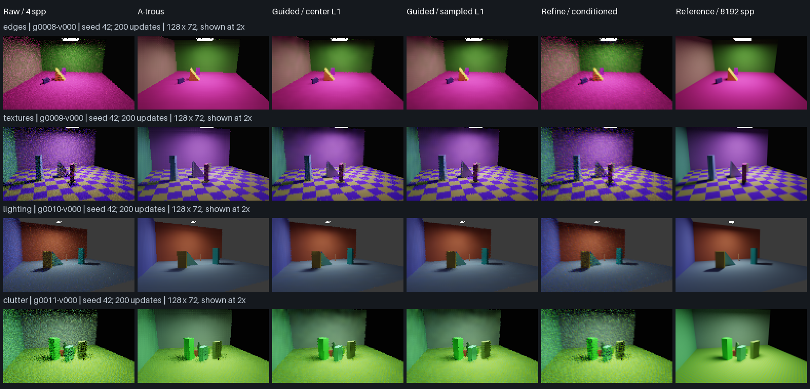

# Research corrections: implementation and measured controls

The refinement head and 2× double attenuation have explicit corrected alternatives.
Support-aware learning telemetry, sampled-guide controls, and a linear relative-L2
loss control are implemented and tested. **The bounded study supports conditioning
the additive refinement head, but does not support replacing the current center
filtering guides or base loss with the tested alternatives. No model was promoted.**

Implementation and experiment source: `999346570f63ea48999a30dd350f5ce57e64c6b3`.
See the [exact model contracts and procedure](../../docs/neural-reconstruction-controls.md),
[configuration](../configs/research/literature-controls.yaml), and
[literature audit](../../docs/neural-reconstruction-literature-review.md).

## What changed

- DetailNet refinement and its learned upscale head can use additive log-radiance
  corrections with internal radiance conditioning. This removes the legacy limit
  of approximately 0.064 maximum output from black input. Units and the physical
  HDR ceiling remain unchanged; excluded and 128-spp pixels retain exact fallback.
- New 2× graphs can blend once after reconstruction. A neutral upscaling head
  retains the matching spatial correction at 4, 32, 64, 96 and 128 samples. The
  previous graph retained only one third of that correction at 96 samples.
- Learning-health schema 2 records raw/prediction error and observation counts for
  the actual model region. An explicit model-region warning avoids misdiagnosing
  good learning when unchangeable fallback pixels dominate whole-image loss.
- Guide and loss hypotheses are explicit configuration controls, preserving
  historical checkpoint defaults. Their implementation does not imply adoption.

## Measured study

Eight new 128×72 views were selected deterministically from the source pilot:
first view in each of four training and four validation strata. Each has four
noisy inputs (4/16 spp × two noise streams), a 4,096-spp primary reference and an
independent 8,192-spp check. Rendering finished in **378.71 seconds**. The 14 fits
(seven recipes × two seeds, 200 updates each) finished in **59.67 seconds** on MPS.
These are experiment durations under concurrent data generation, not inference
benchmarks or a rendering speedup.

All fits used the same crop/example schedule within a seed and the same optimizer
settings. Only primary training references were used for fitting. Final checkpoints
were evaluated on all 16 full validation images against both reference estimates.
No best-epoch search or test-split evaluation was performed. The guide/loss recipes
use the base objectives without auxiliary gradient/energy penalties to isolate
loss kind; they are not the full C5 training recipe.

The following values average images within layout, then layouts equally, then the
two optimization seeds. Baselines are deterministic and counted once. Scores below
use the **independent 8,192-spp reference**. Higher SSIM and lower errors are better.

| Method | SSIM | Display edge error | Whole-image HDR MSE | Model-region HDR MSE |
| --- | ---: | ---: | ---: | ---: |
| Raw | 0.815847 | 0.080746 | 0.206456 | 0.0023020 |
| A-trous | 0.957216 | 0.044876 | **0.204808** | 0.0019774 |
| Guided, center, base log L1 | **0.967074** | **0.040772** | 0.206148 | **0.0019253** |
| Guided, sampled, base log L1 | 0.965908 | 0.042251 | 0.206151 | 0.0019291 |
| Guided, center, relative L2 | 0.962331 | 0.042090 | 0.206150 | 0.0019277 |
| Guided, sampled, relative L2 | 0.961566 | 0.043769 | 0.206154 | 0.0019327 |
| Refinement, legacy head | 0.820306 | 0.079369 | 0.206426 | 0.0022659 |
| Refinement, additive head, scale 1 | 0.819882 | 0.079142 | 0.206451 | 0.0022959 |
| Refinement, additive head, scale 16 | 0.877878 | 0.064506 | 0.206301 | 0.0021126 |

Conditioned refinement improves SSIM by **0.0576** and reduces edge error by
**18.7%** compared with legacy refinement, but still trails the guided model.
Removing the representational cap alone did not improve this short run: internal
conditioning mattered. These are full-validation results, not a comparison between
the first and last stochastic training batches.

The center-guided/base-loss control has 9.15% lower display edge error than a-trous
and 2.63% lower conditional HDR MSE in the model region. Its **whole-image HDR error
is 0.654% worse**. That distinction remains important: raw fallback regions are
unchanged and dominate absolute radiance error. SSIM does not resolve this failure.

Sampled guides reduce SSIM and increase edge error relative to center guides for
both seeds. Relative L2 also underperforms the base loss in this short, fixed-rate
comparison. These effects retain their direction with the 4,096-spp references.
This rejects an immediate default switch; it does not establish that these methods
are intrinsically inferior after suitable tuning, longer training, guide prefiltering
or a different architecture.

## Reference uncertainty

The independent references still disagree, especially on bright/mixed pixels.
Below are scene means over validation, using identical primary-reference masks for
both reference estimates. Model/bypass masks come from the actual noisy-input policy;
those counts vary with input samples and realization. Values are **conditional
region MSEs**, not contributions that can be summed.

| Region | 4,096-vs-8,192 reference disagreement MSE |
| --- | ---: |
| Model region | 0.000004277 |
| Bypass region | 0.002887675 |
| Two-pixel edge band | 0.003237662 |
| Highlights | 0.665183676 |

For center-guided/base-loss reconstruction, the model-region advantage over a-trous
is about 0.0000526 with the primary estimate and 0.0000521 with the check estimate.
The reference disagreement is about 8% of this aggregate advantage. This is a
sensitivity observation, **not a confidence bound or convergence certificate**.
Reference-defined masks themselves are noisy, rare paths can be missed by both
estimates, and four layouts provide little generalization evidence. Highlight error
in particular is unqualified. No images or regions were excluded from the results.

## Labeled images

All four validation layouts are shown at 4 spp, noise stream 0, optimization seed
42. Selection was fixed by layout/stream before inspecting outputs. Each image is
128×72, enlarged 2× by nearest neighbor for inspection; the same ACES/sRGB display
transform is used throughout. The last column is the independent 8,192-spp check,
which still contains sampling error. CPU inference from checksum-verified checkpoints
was compared with each displayed saved MPS prediction before making the panel.

## Evidence and verification

- [Compact scene-mean results, both references and seeds](detail-development/literature-controls-summary.json)
- [Complete per-image comparison and learning observations, compressed JSON](detail-development/literature-controls-per-image.json.gz)
- [Cohort provenance, sample receipts and reference-region errors, compressed JSON](detail-development/literature-cohort-receipt.json.gz)
- Retained NPZs: `/Volumes/Zach's SSD/RayTracer/datasets/literature-cohort-v1`.
- Checkpoints and predictions: `/Volumes/Zach's SSD/RayTracer/runs/literature-controls-v1`.

The suite passed **116 tests**, with two optional OpenImageIO tests skipped. It covers
nonzero learned head output, HDR/zero input, spatially varying sample counts, exact
fallback, odd shapes, FP32/mixed-precision ONNX, native tiled inference, stochastic
training resume, observer gradient/RNG neutrality, reference retention and cohort
integrity. All six legacy audit probe groups reproduce exactly. The additional
summary integration check passed and the figure's CPU/MPS checks passed. Ruff and
format checks passed. No C++ implementation changed in this correction.

Before a release, finalists still need full-recipe and longer-run comparisons,
independent scene families and resolutions, better reference precision or explicit
regional exclusions determined before final evaluation, confidence/fallback and
transport studies, temporal/progressive tests, and matched-quality end-to-end timing.
The completed 512-pixel collection (896 inputs) and ongoing larger collection are
preserved for subsequent studies. These bounded fits are finished and should not
be automatically resumed or installed as the viewer's default model.
